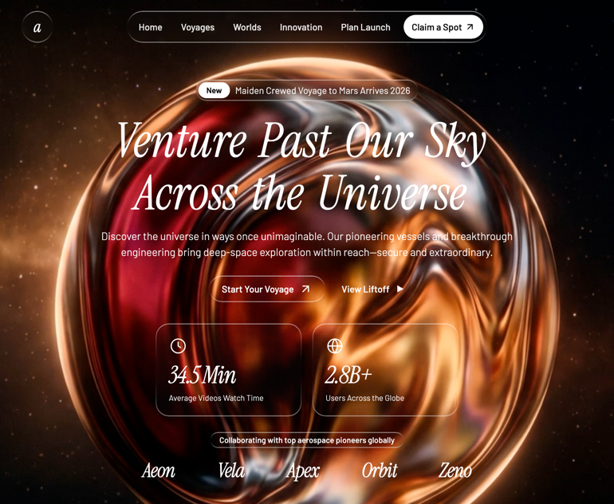

# 01 — Aetheris Voyage

Landing page cinematográfica de viajes espaciales con dos secciones a pantalla completa, vídeos de fondo en loop con crossfade JS, sistema de diseño *liquid-glass* y animaciones de entrada con Framer Motion.

## 🖼️ Preview

> ⚠️ Falta pegar `preview.png` en esta carpeta (la imagen que compartiste en el chat).

## 🧱 Tecnologías

Todo vía **CDN**, sin build step. Abrir `index.html` directamente en el navegador.

- **Tailwind CSS** (CDN runtime)
- **React 18.3.1** (UMD dev)
- **Babel Standalone 7.29.0** (transpila JSX en el navegador)
- **Framer Motion 11.11.17** (animaciones)
- **Google Fonts**: Instrument Serif (titulares en cursiva) + Barlow (cuerpo)

## 🧩 Secciones

1. **Hero** (full viewport, fondo negro)
   - Vídeo de fondo en loop con crossfade custom (rAF, sin transiciones CSS)
   - Navbar fija con logo, pill central de 5 enlaces + CTA "Claim a Spot"
   - Badge "New · Maiden Crewed Voyage to Mars Arrives 2026"
   - Titular `Venture Past Our Sky Across the Universe` con animación palabra-a-palabra (BlurText)
   - Subtítulo + 2 CTAs (primario glass-strong + texto plano con play)
   - 2 stats cards (34.5 Min · 2.8B+)
   - Bloque de partners (Aeon · Vela · Apex · Orbit · Zeno)

2. **Capabilities** (min-h-screen, fondo negro)
   - Vídeo de fondo full-bleed con el mismo FadingVideo
   - Header `// Capabilities` + titular `Production / evolved`
   - 3 cards liquid-glass: **AI Scenery**, **Batch Production**, **Smart Lighting**

## 🎨 Sistema de diseño

- **Liquid Glass**: dos variantes (`.liquid-glass` y `.liquid-glass-strong`) con `backdrop-filter` y borde de máscara gradiente.
- **Border radius por defecto**: `9999px` (todo `rounded` → pill).
- **Tipografía**: titulares en Instrument Serif *siempre en cursiva*, cuerpo en Barlow.
- **Paleta**: solo blanco + transparencias sobre negro. Sin gradientes de color, sin verde.

## ⚙️ Componentes JS reutilizables

- **`FadingVideo`** — vídeo loop con crossfade rAF (FADE_MS 500, FADE_OUT_LEAD 0.55s). No usa el atributo `loop` nativo.
- **`BlurText`** — anima palabras con `IntersectionObserver` (10% threshold) + keyframes blur/opacity/y. Stagger 100 ms.

## ▶️ Cómo usarla

1. Abrir `index.html` directamente en el navegador (doble clic) o servirla con cualquier server estático (`npx serve .`).
2. No necesita `npm install` ni build.
3. Los vídeos están alojados en CloudFront (URLs externas) — si se cae la fuente habrá que sustituirlas.

## 📝 Notas / Pendientes

- [ ] Añadir `preview.png` (imagen referencial)
- [ ] Probar responsive en móvil real (md: breakpoints definidos pero no validados)
- [ ] Decidir si descargamos los vídeos en local o seguimos con CloudFront
- [ ] Posible adaptación: cambiar copy + vídeos para reutilizar la estructura en otro nicho
