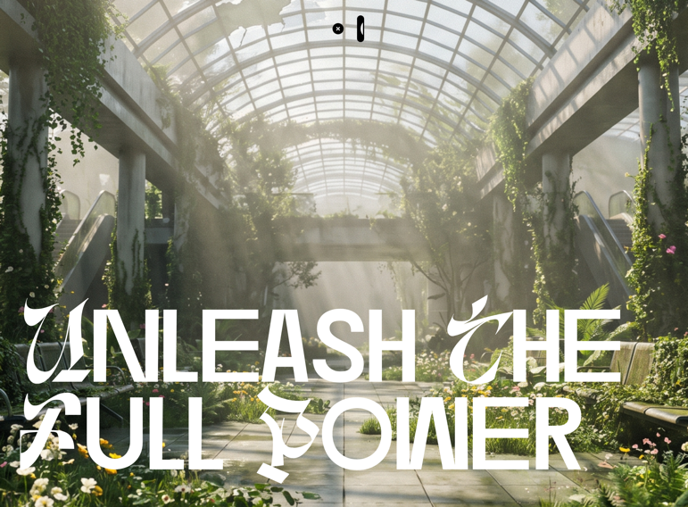

# 02 — Unleash The Full Power

Hero scroll-driven con vídeo HLS que se *escrubea* al hacer scroll, titular gigante con la fuente Dirtyline 36DaysOfType que se desintegra al avanzar, panel "About Us" con efecto glass + parallax 3D que entra deslizándose desde abajo, y una pill nav con efecto de relleno líquido en hover.

## 🖼️ Preview



## 🧱 Tecnologías

Adaptado a **single-file HTML** vía CDN (el spec original es Vite + TS).

- **Tailwind CSS v4** (browser/Play CDN `@tailwindcss/browser@4`)
- **React 19** (UMD dev)
- **Babel Standalone** (JSX en el navegador)
- **GSAP 3.12.5** + **ScrollTrigger** + **ScrollToPlugin**
- **hls.js 1.5.13** (streaming HLS de Mux)
- **Fuentes**: Manrope, Instrument Serif (Google Fonts) + **Dirtyline 36DaysOfType 2022** (local en esta carpeta)

## 🧩 Capas (z-index ascendente)

| Layer | Componente | Posición | Función |
|---|---|---|---|
| 0 | `ScrollVideo` | `fixed inset-0 z-0` | Vídeo HLS de fondo que avanza/retrocede con el scroll |
| 10 | `ScrollFloat` | `fixed bottom z-10` | Titular `Unleash The / Full Power` que se desintegra |
| 20 | `GlassPanel` | `absolute bottom-0 z-20` | Panel "About Us" que sube al final del scroll |
| 100 | `PillNav` | `fixed top z-100` | Nav central con liquid-fill hover |

El contenedor de scroll es `height: 500vh` — el viewport hace 5 alturas de scroll de animación.

## ⚙️ Componentes clave

### `ScrollVideo`
- **hls.js** con buffer agresivo (200 MB) y siempre fuerza la calidad máxima
- **ScrollTrigger scrub** sincroniza `video.currentTime = self.progress * duration`
- **Throttling**: si `video.seeking === true`, marca `seekPending` y reseekea al `seeked` event (evita martillear el decoder)
- Fallback Safari nativo (HLS sin hls.js)
- **Mouse parallax** sobre el wrapper (GSAP, ease power2.out)
- Overlay `Loading... X%` calculado desde `FRAG_BUFFERED`

### `ScrollFloat`
- Divide el texto por `\n` (líneas), espacios (palabras) y caracteres
- Cada char → `<span class="char">` animado con GSAP
- From `{opacity:1, yPercent:0}` → To `{opacity:0, yPercent:250, scaleY:1.2, scaleX:0.9}`
- ScrollTrigger: `trigger: body`, `start: 'top top'`, `end: '+=1000'`, `scrub: 1.5`, `stagger: 0.05`

### `GlassPanel`
- Slide-up: `from {y:'100%'}` → `to {y:'0%'}` (scrub 1.5)
- Estilos inline: `backdrop-filter: blur(160px)`, fondo `rgba(0,0,0,0.16)`, borde sutil
- **3D mouse parallax**: `rotationY` + `rotationX` proporcionales al cursor (perspective 1000px en wrapper)
- Marquee de logos (texto, no imágenes): VOICEFLOW · ZENDESK · PENDO · GLIDE · CANVA · loop infinito 20s

### `PillNav`
- Logo circular negro 48×48 con SVG de 4 pétalos (rota 360° en hover)
- Pills con **efecto de relleno líquido**: el círculo `.hover-circle` se calcula geométricamente para que escale 3× y cubra la pill perfectamente desde abajo
- `.label-stack` con dos labels (texto negro normal + texto blanco que sube)
- HOME → scroll a 0 con `gsap.to(window, {scrollTo:0})`
- ABOUT → scroll al final con `scrollTo: document.body.scrollHeight`
- Responsive: hamburger a < 768px con popover animado

## ▶️ Cómo usarla

1. **Servir con HTTP** (no `file://`) porque la fuente local y el HLS requieren protocolo http.
   ```powershell
   cd "plantillas\02-unleash-full-power"
   npx serve .
   ```
2. Abrir `http://localhost:3000` (o el puerto que dé `serve`).
3. La fuente `Dirtyline-36daysoftype-2022.woff2` ya está en esta carpeta — no hace falta descargarla otra vez.

## 🔁 Versión Vite original (referencia)

El spec apunta a un proyecto Vite con:
- `package.json` — react 19, react-dom, react-router-dom, gsap, hls.js, lucide-react, motion, tailwindcss v4, @tailwindcss/vite, @vitejs/plugin-react, vite
- `vite.config.ts` — plugins `tailwindcss()` + `react()`
- `main.tsx` — `<StrictMode><BrowserRouter><App/></BrowserRouter></StrictMode>`
- CSS con `@import "tailwindcss"` + `@theme {...}` + `@font-face`

La versión single-file de esta carpeta es funcionalmente equivalente — Tailwind v4 con `@theme` corre en runtime gracias a `@tailwindcss/browser`.

## 📝 Notas / Pendientes

- [ ] Probar performance del scrub HLS en hardware modesto — puede ir a tirones con bitrates altos
- [ ] El vídeo Mux es de demo (`43NlHXsaMrmyzWamMk87m01fNyxSTekAD669BBAPBNm00.m3u8`) — puede caer
- [ ] Validar GlassPanel parallax 3D en mobile (puede no tener sentido sin cursor)
- [ ] La fuente Dirtyline está en `Dirtyline-36daysoftype-2022.woff2` junto al index — si copias el HTML a otro proyecto, mueve también el woff2
