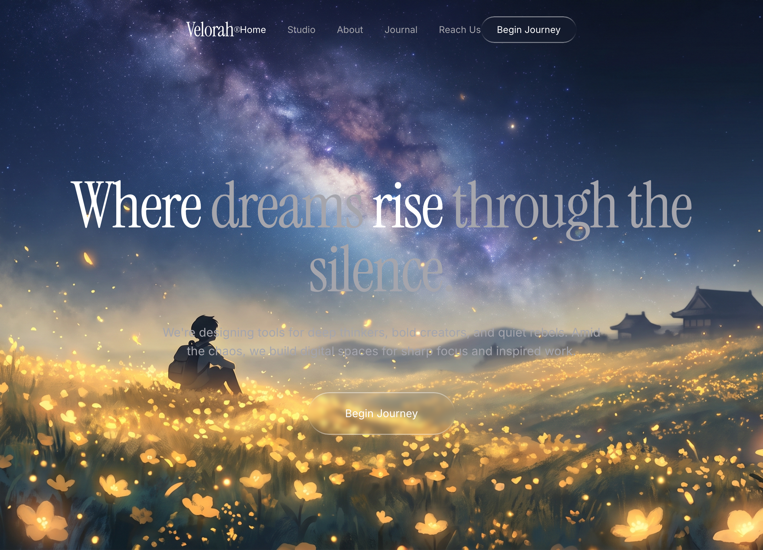

# 03 — Velorah · Where dreams rise through the silence

Hero único a pantalla completa: vídeo de fondo en loop, navegación glassmorphic minimalista y tipografía cinematográfica (Instrument Serif + Inter). Sobre fondo navy profundo con `<em>` en gris muted para contrastar palabras clave del titular.

## 🖼️ Preview

## 🧱 Tecnologías

Todo vía **CDN**, sin build step. Misma convención que las plantillas 01 y 02 — la spec original pedía React + Vite + TS + shadcn/ui, pero se adapta al formato del catálogo (HTML autocontenido).

- **Tailwind CSS** (CDN runtime, con `tailwind.config` inline que mapea CSS vars → colores)
- **React 18.3.1** (UMD dev)
- **Babel Standalone 7.29.0** (transpila JSX en el navegador)
- **Google Fonts**: Instrument Serif (titulares) + Inter 400/500 (cuerpo)

## 🧩 Secciones

Única sección (single-page hero):

1. **Background video**
   - `<video autoPlay loop muted playsInline>` fullscreen, `absolute inset-0 w-full h-full object-cover z-0`
   - CloudFront source (mp4)

2. **Navbar** — `relative z-10`, `max-w-7xl mx-auto`, `flex justify-between px-8 py-6`
   - Logo `Velorah®` (Instrument Serif 3xl, `®` en `` xs)
   - Links centrales (Home / Studio / About / Journal / Reach Us) — `hidden md:flex`, Home activo
   - CTA glass pill `Begin Journey`

3. **Hero** — vertical center, `text-center`, padding 90px vertical
   - H1 `5xl → 7xl → 8xl`, leading 0.95, tracking `-2.46px`, Instrument Serif normal
   - Palabras "dreams" y "through the silence." envueltas en `<em class="not-italic text-muted-foreground">` para contraste de color
   - Subtítulo en muted-foreground, max-w-2xl
   - CTA glass pill ancho (`px-14 py-5`)

## 🎨 Sistema de diseño

- **Paleta** (HSL en CSS vars):
  - `--background: 201 100% 13%` → navy profundo
  - `--foreground: 0 0% 100%`
  - `--muted-foreground: 240 4% 66%`
  - `--primary / secondary / muted / accent / border / input` definidos pero apenas usados en este hero
- **Tipografía**:
  - Display: Instrument Serif (sin cursiva, contrario a plantilla 01)
  - Body: Inter 400/500
- **Liquid Glass**: variante sutil (`blur(4px)`, gradient mask top/bottom) reutilizable en navbar y CTAs.

## ⚡ Animaciones

CSS keyframe `fade-rise` (translateY 24px → 0, opacity 0 → 1, 0.8s ease-out) con 3 niveles de delay:

- `.animate-fade-rise` → H1 (0s)
- `.animate-fade-rise-delay` → subtítulo (0.2s)
- `.animate-fade-rise-delay-2` → CTA hero (0.4s)

Sin Framer Motion, sin JS de animación. CTAs tienen `hover:scale-[1.03]` por Tailwind.

## ▶️ Cómo usarla

1. Abrir `index.html` directo en el navegador o servirla con cualquier static server (`npx serve .`).
2. Sin `npm install`, sin build.
3. El vídeo está en CloudFront — si la URL cae habrá que sustituirla.

## 📝 Notas / Pendientes

- [x] Añadir `preview.png` (Captura de pantalla 2026-05-13 114226)
- [ ] Validar en móvil real (md: breakpoint marca el toggle del nav central)
- [ ] La spec original pedía Vite + TS + shadcn — si en algún momento se quiere migrar al stack real, los tokens HSL + Tailwind config ya están listos para `tailwind.config.ts`.
