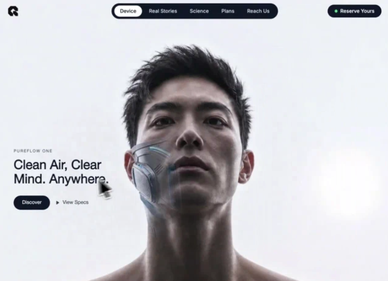

# 05 — PureFlow One

Hero único con efecto **spotlight reveal**: dos imágenes apiladas, donde la segunda solo se ve dentro de un degradado radial dibujado en `<canvas>` y aplicado como `mask-image` siguiendo al cursor con easing. Rejilla SVG de fondo con parallax sutil, navegación pill central, CTA con punto verde, hamburguesa móvil.

## 🖼️ Preview

## 🧱 Tecnologías

Vía **CDN**, sin build step (adaptación de la spec original React + Vite + TS + Tailwind al formato del catálogo).

- **Tailwind CSS** (CDN runtime)
- **React 18.3.1** (UMD dev)
- **Babel Standalone 7.29.0** (transpila JSX en navegador)
- **Inter** (Google Fonts, 300/400/500/600/700) aplicada globalmente con `* { font-family: 'Inter', sans-serif; }`
- **Iconos lucide**: inline SVG con los paths exactos de `lucide-react` (Play, Menu, X)

## 🧩 Sección única (Hero)

`<section style="height: 100vh">` con cuatro capas apiladas:

1. **Rejilla SVG de fondo** (`z-0`, opacity 0.1)
   - `<pattern id="grid" width=48 height=48 patternUnits="userSpaceOnUse">` con un `<path d="M 48 0 L 0 0 0 48">` (línea de esquina), stroke `#64748b`, strokeWidth 0.6.
   - El `x` y `y` del pattern se actualizan cada frame desde `gridOffsetRef`, dando un efecto de parallax sutil cuando el cursor se mueve.
2. **`BG_IMAGE_1`** — capa base (`z-10`).
3. **`RevealLayer`** (`z-30`) — `BG_IMAGE_2` enmascarado con un canvas radial.
4. **Bloque de texto** (`z-50`) — eyebrow "PureFlow One", H1 "Clean Air, Clear / Mind. Anywhere.", botones "Discover" y "View Specs" con icono Play.

### Navegación (`fixed top-0`)

- **Logo** SVG inline (path con 256×256 viewBox, fill `#111111`).
- **Pill central (desktop)** — `bg-gray-900 rounded-full`, contiene "Device" activo (`bg-white text-gray-900`) + "Real Stories", "Science", "Plans", "Reach Us" en `text-gray-300`.
- **CTA derecho (desktop)** — "Reserve Yours" con punto `bg-green-400`.
- **Móvil** — hamburguesa lucide (Menu/X) que abre un dropdown vertical con los mismos items + CTA.

## 🎯 Efecto spotlight (corazón de la plantilla)

Pipeline por frame (`requestAnimationFrame` continuo):

1. **Listener `mousemove`** → `mouseRef = { x, y }` (raw).
2. **Easing `smoothRef`** hacia `mouseRef` con factor `0.1`.
3. **Cálculo de offset normalizado**: `cx = (smooth.x - rect.left) / rect.width - 0.5`, igual para `cy`.
4. **Easing `gridOffsetRef`** hacia `cx * 16, cy * 16` con factor `0.06`. Se aplican directamente como atributos `x` / `y` del `<pattern>` (sin causar re-render React).
5. **`setCursorPos(smooth)`** → estado React → re-render de `RevealLayer`.
6. **`RevealLayer` useEffect** (sin deps, corre cada render):
   - Limpia el canvas (tamaño `window.innerWidth × window.innerHeight`).
   - `createRadialGradient(cx, cy, 0, cx, cy, 260)` con 6 stops (1, 1, 0.75, 0.4, 0.12, 0).
   - Dibuja un `arc` completo relleno con ese gradiente.
   - `canvas.toDataURL()` → asigna como `mask-image` + `webkit-mask-image` al div con `BG_IMAGE_2`.
   - `mask-size: 100% 100%`, `mask-repeat: no-repeat`.

> Coste real: `toDataURL()` cada frame es caro (PNG encoding). En esta plantilla compensa por el efecto visual exacto del spec. Para producción se podría sustituir por un `<canvas>` directo posicionado y con `mix-blend-mode`, o por `CSS Houdini Paint Worklet`.

## 🎨 Sistema de diseño

- **Color**: blanco como fondo, neutros (`gray-900`, `gray-800`, `gray-700`, `gray-600`, `gray-300`, `gray-100`) y un único acento `bg-green-400` (punto de status). Sin morados ni índigos.
- **Tipografía**: Inter para todo. Pesos 300–700.
- **Forma**: navegación 100% pill (`rounded-full`), botones pill, iconos lucide.
- **Responsive**:
  - Móvil/tablet `<sm`: oculta pill central y CTA, muestra hamburguesa. Hero text a `bottom-12`.
  - Tablet `sm`: mismo hero `bottom-12`.
  - Desktop `md+`: pill central + CTA derecho; hero text a `bottom-56`.

## ⚙️ Notas de implementación

- **Refs**: `sectionRef`, `mouseRef`, `smoothRef`, `gridOffsetRef`, `patternRef`. Estado solo `cursorPos` y `menuOpen`.
- **Fallback `patternRef`**: si por alguna razón el ref no se ha enganchado, hace `document.getElementById('grid')` y lo cachea — pragmático para entornos donde el ref a `<pattern>` dentro de `<defs>` no se enlaza inmediatamente.
- **Resize**: listener que reasigna `canvas.width / canvas.height` al viewport completo.
- **Iconos**: en lugar de cargar `lucide-react` por UMD, inline los SVG con los paths exactos de la librería para Play, Menu, X. Mismo resultado visual, cero dependencia extra.

## ▶️ Cómo usarla

1. Abrir `index.html` directamente en el navegador.
2. **Importante**: el efecto spotlight requiere que la pestaña esté en primer plano (`document.hidden === false`). En el iframe del viewer del catálogo o en una pestaña en background, `requestAnimationFrame` queda throttled a ~0 fps y el spotlight no se anima (verificado).
3. Sin `npm install`, sin build.
4. Las dos imágenes están en `images.higgs.ai` — si caen, sustituir las URLs en los `const BG_IMAGE_1` / `BG_IMAGE_2`.

## 📝 Notas / Pendientes

- [x] Añadir `preview.png` (Captura de pantalla 2026-05-13 125602 — hero con el spotlight visible junto al rostro, mostrando el efecto reveal del dispositivo de aire)
- [ ] Probar en móvil real (la spec especifica hero `bottom-12` en `<sm` y `<md`)
- [ ] Considerar lazy-init del rAF si la pestaña entra en `visibilityState: 'hidden'` (Page Visibility API) para ahorrar CPU.
