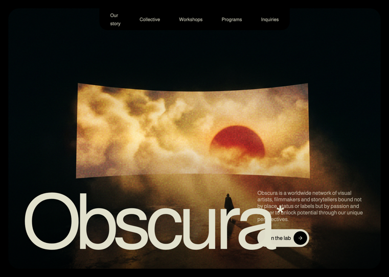

# 06 — Prisma · Visual arts collective

Landing oscura y cinemática para un colectivo creativo. Tres secciones (Hero, About, Features) con paleta crema cálida sobre negro profundo, tipografía Almarai + Instrument Serif italic, y animaciones de palabras / scroll-linked / fade-in con Framer Motion.

## 🖼️ Preview



## 🧱 Tecnologías

Vía **CDN**, sin build step. Adaptación de la spec original (React + Vite + TS + Tailwind + framer-motion + lucide-react) al formato del catálogo.

- **Tailwind CSS** (CDN runtime, con `tailwind.config` extendiendo `colors.primary: #DEDBC8` y `fontFamily.serif: ['"Instrument Serif"', 'serif']`)
- **React 18.3.1** (UMD dev)
- **Babel Standalone 7.29.0** (transpila JSX)
- **Framer Motion 11.11.17** (UMD → `window.Motion`)
- **Google Fonts**: Almarai (300/400/700/800) + Instrument Serif italic
- **Iconos lucide** (ArrowRight, Check) inline con los paths exactos

## 🎨 Sistema de diseño

- **Fondo**: `#000000` global, `#101010` para la card de About, `#212121` para las cards de Features.
- **Texto primario**: `#E1E0CC` (inline) — ligeramente distinto de Tailwind `primary: #DEDBC8` (que sirve para utilidades como `text-primary`, `text-primary/70`, `bg-primary`).
- **Texto gris**: `text-gray-400`, `text-gray-500`.
- **Nav links**: `rgba(225,224,204,0.8)` con hover a `#E1E0CC`.
- **Tipografía**:
  - Global: **Almarai** (300/400/700/800)
  - Italic accents en About: **Instrument Serif** italic vía `font-serif italic`

## 🌫️ Texturas SVG

Dos utilidades CSS con `feTurbulence` inline como data URI:

```css
.noise-overlay { /* baseFrequency 0.85, octaves 3 — overlay del hero */ }
.bg-noise      { /* baseFrequency 0.9,  octaves 4 — bg sutil en Features */ }
```

## 🧩 Secciones

### 1. Hero (`h-screen`, `p-4 md:p-6`)
- Contenedor con `rounded-2xl md:rounded-[2rem]` y `overflow-hidden`
- Vídeo de fondo `object-cover` + `noise-overlay` (mix-blend-overlay, opacity 0.7) + gradiente `from-black/30 via-transparent to-black/60`
- Navbar pill negra colgando del borde superior con 5 links: *Our story · Collective · Workshops · Programs · Inquiries*
- **Título "Prisma"** gigante (`text-[26vw]` → `2xl:text-[20vw]`) con `tracking-[-0.07em]` y `leading-[0.85]`, **asterisco superíndice** en la última letra
- Descripción + CTA "Join the lab" (pill cream con círculo negro y ArrowRight)
- Animaciones: pull-up word-by-word para el título, fade-up con delays 0.5/0.7s y ease `[0.16, 1, 0.3, 1]` para descripción y CTA

### 2. About (`bg-black`, padded)
- Card `bg-[#101010]`, `max-w-6xl mx-auto`, centrada
- Eyebrow "Visual arts"
- Heading multi-style en 3 segmentos:
  1. *I am Marcus Chen,* — normal
  2. *a self-taught director.* — italic Instrument Serif
  3. *I have skills in color grading, visual effects, and narrative design.* — normal
- Cada palabra anima individualmente con pull-up (stagger 0.08s)
- Body paragraph debajo con **reveal carácter a carácter por scroll** (`useScroll` + `useTransform`, offset `['start 0.8', 'end 0.2']`, cada char opacity 0.2→1)

### 3. Features (`min-h-screen`, `bg-black` + `bg-noise` overlay)
- Header 2 líneas con WordsPullUpMultiStyle (cream + gray-500)
- Grid `grid-cols-1 md:grid-cols-2 lg:grid-cols-4`, gap responsivo, altura `lg:h-[480px]`
- **Card 1 (vídeo)**: vídeo loop fullscreen, texto bottom "Your creative canvas."
- **Cards 2-4 (checklist)**: `bg-[#212121]`, icono PNG rounded, número (01/02/03) + título, lista con Check icons en color primary, link "Learn more" con ArrowRight rotado -45deg
- Cada card entra con `scale: 0.95 → 1` + fade, stagger 0.15s, ease `[0.22, 1, 0.36, 1]`, trigger `useInView({ once, margin: '-100px' })`

## ⚙️ Componentes de animación

- **`WordsPullUp`** — split text por espacios, cada palabra como motion.span con stagger 0.08s. Soporta `showAsterisk` para añadir un superíndice `*` al final.
- **`WordsPullUpMultiStyle`** — acepta `segments: [{ text, className }]`, aplana en palabras preservando la clase por segmento. Usado tanto para el heading mixto de About como para los dos renglones de Features.
- **`AnimatedLetter` + `ScrollText`** — para el reveal por scroll del párrafo de About. Cada carácter mapea su opacity de `[charProgress - 0.1, charProgress + 0.05]` → `[0.2, 1]` sobre el `scrollYProgress` del párrafo.

## ▶️ Cómo usarla

1. Abrir `index.html` directamente en el navegador.
2. Sin `npm install`, sin build.
3. Los assets están en CloudFront / `images.higgs.ai`. Si caen, sustituir las URLs en los `const` del top del script.

## 📝 Notas / Pendientes

- [x] Añadir `preview.png` (Captura de pantalla 2026-05-13 134308 — composición Hero + About: título "Prisma*" sobre paisaje + card #101010 con tipografía mixta Almarai/Instrument Serif italic)
- [ ] Validar el reveal por scroll en navegadores móviles (iOS Safari tiene comportamiento peculiar con `useScroll`).
- [ ] El catálogo (viewer) muestra la plantilla en un iframe — verificar que el scroll del iframe alimenta correctamente el `useScroll`. Si no, considerar usar `IntersectionObserver` como fallback en `AnimatedLetter`.
- [ ] Los items de los checklist son razonables pero no estaban listados verbatim en la spec — ajustar si se quieren textos exactos.
