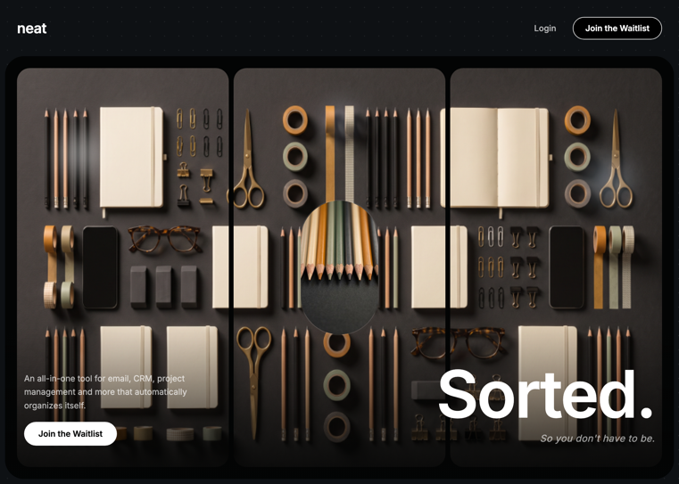

# 07 — micro · Organized. So you don't have to be.

Hero único oscuro con un **vídeo que se reproduce hacia delante una vez, se captura frame a frame en canvas, y después se renderiza en bucle boomerang** sobre 3 canvases sincronizados que se comportan como una sola superficie `object-cover` partida en tercios. Diseño minimalista: tipografía Inter, fondo `#0E1114` con puntos sutiles, card interior `#030404`, orbes glow con `mix-blend-mode: screen`, píldora con imagen central, gradiente de fade y CTA.

## 🖼️ Preview



## 🧱 Tecnologías

Vía **CDN**, sin build step. Adaptación de la spec original (React + Vite + TS + Tailwind) al formato del catálogo.

- **Tailwind CSS** (CDN runtime)
- **React 18.3.1** (UMD dev)
- **Babel Standalone 7.29.0** (transpila JSX)
- **Google Fonts**: Inter (300–700)
- **Sin Framer Motion ni iconos** — todo CSS / Canvas API nativa

## 📦 Asset local

El vídeo (28.8 MB) **se descarga en local** a `boomerang.mp4` junto al `index.html`. La spec original explícitamente pide esto (streaming desde CloudFront + `currentTime` seek = lag); además evita problemas de CORS al hacer `drawImage` del vídeo en canvas.

El `VIDEO_SRC` se resuelve dinámicamente desde `location.pathname` para funcionar con URLs `…/index.html`, `…/` (slash) o `…` (sin slash).

## 🎯 Pipeline de captura + boomerang (corazón de la plantilla)

```
[mount] →  v.play()  →  por cada frame (requestVideoFrameCallback):
                       │
                       └─ dibuja v → canvas offscreen (max 960 px) →
                          push al array framesRef.current[]
                       
[video 'ended'] →  setFramesReady(true)  →  arranca el render loop

[render loop @ 30fps via rAF]:
   draw(idx) sobre todos los canvas visibles
   idx += dir
   if (idx === frames.length - 1)  dir = -1   ← boomerang flip
   if (idx === 0)                  dir =  1   ← boomerang flip
```

### Slicing — 3 canvas, un solo vídeo

Cada frame, para cada canvas visible `i` de `n`:

1. Resincroniza el backing store del canvas con `clientWidth/clientHeight` si difieren.
2. Trata los `n` canvas como **una superficie continua** de `(cw * n) × ch`.
3. Calcula el rectángulo fuente `sx, sy, sw, sh` que mantiene el comportamiento `object-fit: cover` para esa superficie virtual.
4. `sliceW = sw / n`, `sliceX = sx + sliceW * i`.
5. `ctx.drawImage(frame, sliceX, sy, sliceW, sh, 0, 0, cw, ch)` — el vídeo queda repartido en los 3 canvas como si fuera una sola imagen.

En móvil (`<sm:640`) sólo el canvas 1 está visible (los otros tienen `hidden sm:block`), y el slicing automáticamente trabaja con `n = 1` → cover completo del frame en un solo canvas.

## 🧩 Layout

```
┌─────────────────────────────────────────────────┐
│  micro                       [Login][Waitlist]  │  ← navbar fuera de la card
├─────────────────────────────────────────────────┤
│ ┌─────────────────────────────────────────────┐ │
│ │ [canvas 0] [canvas 1 + pill] [canvas 2]    │ │  ← inner card #030404 rounded-[32px]
│ │   orb        orb pill           orb         │ │
│ │ ··············· fade gradient ············  │ │
│ │ ┌─ paragraph + Waitlist btn        Organized.│ │
│ │ └────────────────────────────  So you don't…│ │  ← hero text + CTA
│ └─────────────────────────────────────────────┘ │
└─────────────────────────────────────────────────┘
   outer wrapper #0E1114 + dotted radial pattern
```

### Detalles

- **Navbar fuera de la card** — `flex justify-between px-7 py-7 shrink-0`; wordmark `micro` con `letter-spacing: -0.02em`; CTA `Join the Waitlist` con borde blanco 1px sobre negro.
- **Inner card** — `mx-2 mb-2 flex-1 rounded-[32px] overflow-hidden bg-[#030404]`. Tres divs `flex-1 rounded-[22px]` con un `<canvas>` absoluto cada uno.
- **Orbes** — componente reutilizable `<Orb>` con `radial-gradient(circle, COLOR, transparent 70%)`, `filter: blur(20px)`, `mix-blend-mode: screen`. Tres orbes con posiciones y colores específicos por card.
- **Píldora middle** — `width: 130px, height: 225px, border-radius: 999px` con `` `object-fit: cover` y `box-shadow: 0 0 0 1.5px rgba(255,255,255,0.10)`. Aparece sólo encima del canvas 2.
- **Bottom fade** — gradiente lineal `to top` de `rgba(3,4,4,0.88)` a transparente, altura 260px.
- **Hero text + CTA** — H1 `Organized.` con `clamp(52px, 10vw, 110px)`, `letter-spacing: -0.03em`, `line-height: 1.0`; subtítulo italic *"So you don't have to be."*; columna izquierda con párrafo + botón blanco "Join the Waitlist".

## ⚠️ Notas de rendimiento

- El vídeo es de **3828×2164** (4K). El capture escala a max 960 px de ancho — manteniendo aspect — para limitar memoria. Aun así, ~7s de vídeo a 30 fps = ~210 frames × 960×540×4 bytes = **~440 MB** de RAM en el array. Aceptable en desktop, ajustable.
- Si la pestaña queda en background, los navegadores throttlean `requestVideoFrameCallback` y el render loop. La captura se completa cuando vuelves a foreground y dispara `ended`.
- En el iframe del viewer del catálogo o con `document.hidden === true`, el vídeo no llega a reproducirse en absoluto. Abrir el `index.html` directamente.

## ▶️ Cómo usarla

1. Abrir `index.html` directamente en el navegador (no se sirve por iframe en background).
2. Esperar a que aparezca/desaparezca el mensaje "Capturing frames…" — captura todos los frames forward; después arranca el boomerang sobre los 3 canvas.
3. Sin `npm install`, sin build. El `boomerang.mp4` debe estar junto al `index.html`.
4. La imagen de la píldora viene de `images.higgs.ai` (CDN). Si cae, sustituir `PILL_IMG`.

## 📝 Notas / Pendientes

- [x] Añadir `preview.png` (Captura de pantalla 2026-05-13 145455 — paisaje montañoso al atardecer dividido en 3 canvas con la píldora central y "Organized." legible)
- [ ] Considerar limitar el número de frames capturados o downscale a 720px si la memoria es crítica.
- [ ] El mensaje "Capturing frames…" es debug — quitar para producción.
- [ ] El vídeo `boomerang.mp4` (28.8 MB) inflará cualquier zip/repo de la plantilla. Si se quiere un repo ligero, mover el asset a un CDN propio o LFS.
