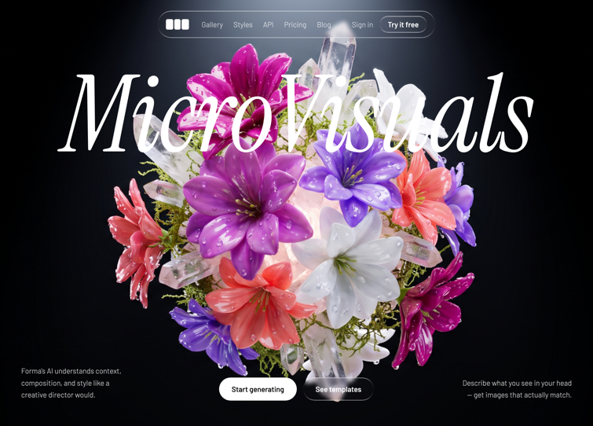

# 08 — MicroVisuals

Hero fullscreen oscuro con un **título italic gigante** ("MicroVisuals" en Instrument Serif clamp 96–280px) sobre un **vídeo en boomerang** capturado frame a frame en canvas y un **parallax sutil con gsap** siguiendo al cursor. Nav `liquid-glass` pill flotante con LogoMark de tres rects, dos CTAs centrados abajo (blanco brillante + glass), y dos párrafos descriptivos en las esquinas inferiores.

## 🖼️ Preview



## 🧱 Tecnologías

Vía **CDN**, sin build step. Adaptación de la spec original (React + Vite + TS + Tailwind + gsap) al formato del catálogo.

- **Tailwind CSS** (CDN runtime, con `tailwind.config` extendiendo `fontFamily` y `borderRadius.DEFAULT: 9999px`)
- **React 18.3.1** (UMD dev)
- **Babel Standalone 7.29.0**
- **GSAP 3.12.5** (UMD → `window.gsap`)
- **Google Fonts**: Instrument Serif (italic + normal) + Barlow (300/400/500/600) + **Dirtyline** vía `fonts.cdnfonts.com` (font-face)

## 📦 Asset local

El vídeo (18.2 MB) está **descargado en local** como `boomerang.mp4` junto al `index.html`. Razones:

1. `drawImage(video, …)` en canvas requiere la respuesta del vídeo con CORS headers (`Access-Control-Allow-Origin`). Servirlo local elimina el riesgo.
2. La spec original lo pide explícitamente porque streaming + seek tiene lag.

El `VIDEO_SRC` se resuelve dinámicamente desde `location.pathname` (gestiona los casos `…/index.html`, `…/` y `…` sin slash).

## 🎯 Pipeline (igual que plantilla 07 pero a pantalla completa)

```
[mount] →  video.play()  →  por cada frame (requestVideoFrameCallback):
                            │
                            └─ snapshot a canvas offscreen (max 960px) →
                               push al array frames[]

[ended] →  setFramesReady(true)  →  arranca el render loop

[render loop @ 30fps via rAF]:
   ctx.drawImage(frames[index], 0, 0) sobre el canvas display único
   index += direction
   if (index === frames.length - 1)  direction = -1   ← flip boomerang
   if (index === 0)                  direction =  1   ← flip boomerang
```

Diferencia con la plantilla 07: aquí **un solo canvas display** ocupa todo el viewport (`object-cover`), no hay slicing. El `<video>` source queda en el DOM oculto vía `display:none` una vez `framesReady === true`.

## 🧲 Parallax con gsap

```
strength = 20  →  -20 .. +20 px de offset máximo
mousemove   →  targetX = ((clientX - vw/2) / (vw/2)) * 20  (idem Y)
each frame  →  currentX += (targetX - currentX) * 0.06  (easing 6%)
             gsap.set(videoBgRef, { x: currentX, y: currentY })
```

El contenedor del vídeo (`videoBgRef`) ya tiene `scale-[1.08]` para que el parallax no muestre bordes. gsap respeta el `scale` existente al setear `x/y` (verificado: `translate(12px, -5px) scale(1.08, 1.08)`).

## 🎨 Sistema de diseño

- **Fondo global**: `#000` puro.
- **Tipografías**:
  - **Heading** (`.hero-title`): Instrument Serif **italic**, `clamp(96px, 18vw, 280px)`, `line-height: 0.92`, `letter-spacing: -0.02em`, blanco, centrado.
  - **Body**: Barlow (300/400/500/600).
  - **Dirtyline**: declarada pero no usada en el hero — disponible para futuras secciones.
- **Border radius default**: `9999px` (override Tailwind → todo `rounded` es pill).
- **Liquid Glass**: variante sutil (`blur(4px)`) usada en navbar y CTA secundario; variante fuerte (`blur(50px)`) usada en el botón "Try it free".

## 🧩 Estructura JSX

1. **Video bg layer** (`fixed inset-0 z-0 scale-[1.08]`): contiene el `<video>` original y el `<canvas>` display. Solo uno visible a la vez según `framesReady`.
2. **Hero title** (`fixed top: 126px z-20`): H1 con `.hero-title`. Fade-up al montar (`mounted` toggle).
3. **Nav** (`fixed top-5 left-1/2 -translate-x-1/2 z-50`): pill `liquid-glass` con `LogoMark + 5 links + Sign in + Try it free`.
4. **Bottom row** (`fixed bottom-12 left-0 right-0 z-20`): párrafo izquierda + 2 CTAs centrados absolute + párrafo derecha. Fade-up con `delay-300`.

## ⚠️ Notas

- En navegadores en background (`document.hidden === true`), el vídeo no se reproduce y la captura nunca completa. Por eso aparece el debug "Capturing frames…" — quitar para producción cuando se valide. Abrir el `index.html` en una pestaña real.
- La fuente Dirtyline viene de `fonts.cdnfonts.com` (third-party CDN sin SLA). Si cae, eliminar el `@font-face` y mantener solo Instrument Serif + Barlow.
- Memoria de los frames capturados: ~150 frames × 960 × ~720 × 4 bytes ≈ **400 MB**. Razonable en desktop, ajustar `MAX_WIDTH` si es crítico.

## ▶️ Cómo usarla

1. Abrir `index.html` directamente en el navegador.
2. Esperar ~6s a que se complete la captura forward (verás "Capturing frames…"), después arranca el boomerang.
3. Mover el cursor: el vídeo se desplaza con parallax suave.
4. Sin `npm install`, sin build.

## 📝 Notas / Pendientes

- [x] Añadir `preview.png` (Captura de pantalla 2026-05-13 151628 — bouquet floral sobre fondo oscuro con título italic "VisualStudio")
- [ ] Quitar el debug "Capturing frames…" cuando se considere final
- [ ] Validar la animación en navegadores móviles (sin mousemove → parallax queda en 0,0; aceptable)
