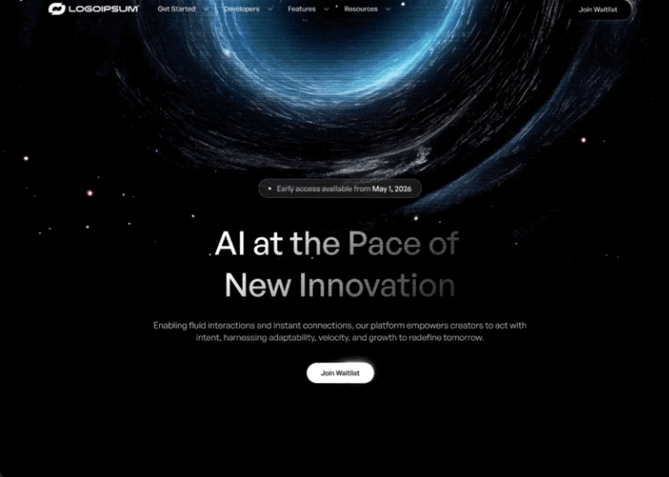

# 09 — EOS · Web3 at the Speed of Experience

Hero fullscreen minimalista para una landing Web3. Vídeo en loop + overlay 50% negro, navbar con logo + 4 links con chevron + CTA pill, y contenido centrado con badge, H1 con gradiente clipeado al texto, subtítulo y CTA pill blanco. Sin animaciones complejas: solo `<video>` autoplay y CSS estático.

## 🖼️ Preview



## 🧱 Tecnologías

Vía **CDN**, sin build step. Adaptación de la spec original (React + Vite + TS + Tailwind) al formato del catálogo.

- **Tailwind CSS** (CDN runtime)
- **React 18.3.1** (UMD dev)
- **Babel Standalone 7.29.0**
- **Fontshare**: General Sans (200–700) aplicada globalmente con `*` selector

## 🎨 Sistema de diseño

- **Color**: negro puro `#000` + blanco. Acentos en `rgba(255,255,255,0.10)` (badge bg), `rgba(255,255,255,0.20)` (badge border), `rgba(255,255,255,0.60)` (badge label muted), `rgba(255,255,255,0.70)` (subtítulo).
- **Tipografía**: General Sans (Fontshare). Pesos 400 (subtítulo) y 500 (links, badge, CTAs, H1).
- **Heading gradient**: `linear-gradient(144.5deg, rgba(255,255,255,1) 28%, rgba(0,0,0,0) 115%)` clipeado al texto vía `background-clip: text` + `-webkit-text-fill-color: transparent`.

## 🧩 Estructura

```
<section relative w-full min-h-screen bg-black>
  ├─ <video> fullscreen muted autoplay loop playsInline (z-0)
  ├─ <div bg-black/50 overlay> (z-1)
  └─ <div z-10 flex flex-col>
       ├─ <nav 20px / 120px padding>
       │   ├─ left: Logo + 4 nav links con chevron-down (hidden md:flex)
       │   └─ right: PillButton variant="dark" (Join Waitlist)
       └─ <div hero> padding-top 280px / bottom 102px, gap 40
            ├─ Badge pill (10% white bg, 1px white/20 border, dot + texto)
            ├─ H1 gradient-text "Web3 at the Speed of Experience" (max-w 613px)
            ├─ Subtitle (white/70, max-w 680px)
            └─ PillButton variant="light" (Join Waitlist)
```

## 🔘 PillButton (componente reutilizable)

Construcción a 3 capas:

1. **Outer**: `<button>`/`<a>` con `border-radius: 9999px`, `border: 0.6px solid white`, `padding: 0.6px`, fondo transparente.
2. **Inner**: `<span>` interior con `border-radius: 9999px`, `padding: 11px 29px`, `font-size: 14px`, `font-weight: 500`. Fondo `#000` (variant `dark`) o `#fff` (variant `light`). Color de texto inverso.
3. **Light streak**: `<span absolute>` en la parte superior (`top: -6px`, ancho 70%, altura 16px) con `linear-gradient(180deg, rgba(255,255,255,0.85) 0%, transparent 100%)` y `filter: blur(6px)`. Genera el reflejo sutil en el borde superior.

Variantes:
- `dark`  → fondo negro + texto blanco (usado en navbar)
- `light` → fondo blanco + texto negro (usado en CTA principal)

## 📱 Responsive

- **md+ (≥768px)**: nav con padding `20px 120px`, links visibles, H1 hasta 56px.
- **<md**: nav con padding `16px 24px` (media query inline al final del documento), links ocultos (`hidden md:flex`), H1 escala a 36px (mínimo del `clamp`).

## ▶️ Cómo usarla

1. Abrir `index.html` directamente en el navegador.
2. Sin `npm install`, sin build.
3. El vídeo está en CloudFront — si cae, sustituir `VIDEO_SRC`.

## 📝 Notas / Pendientes

- [x] Añadir `preview.png` (Captura de pantalla 2026-05-13 152314 — vídeo de fondo con vórtice azul cósmico, badge "Early access available from May 1, 2026", H1 con gradiente y dos CTAs "Join Waitlist")
- [ ] La spec del logo dice "187px wide, 25px tall" — usamos un placeholder de texto `LOGOIPSUM`. Si se quiere un SVG real, sustituir el componente `<Logo>`.
- [ ] El light-streak del pill button se podría afinar (tamaño, blur, posición) para un look más cinemático si se valida en pantalla.
- [ ] El vídeo NO necesita descarga local porque no se usa `drawImage` en canvas (solo se reproduce nativamente), así que CORS no aplica.
