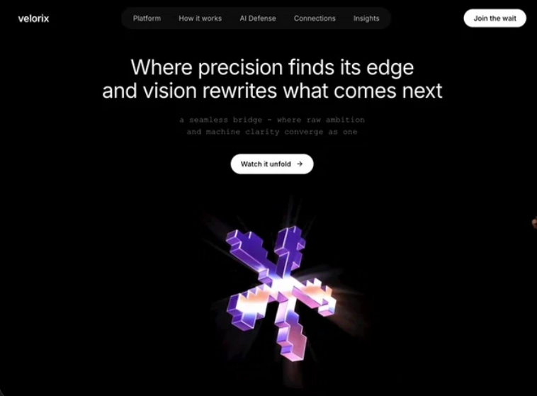

# 10 — velorix · Where precision finds its edge

Hero único minimalista sobre fondo negro. Vídeo en loop, nav pill central oscura `#0C0C0C` con 5 enlaces, menú hamburguesa móvil con backdrop blur + stagger animado, tipografía mixta Inter + Courier New, CTA blanco con flecha que se desliza al hover.

## 🖼️ Preview



## 🧱 Tecnologías

Vía **CDN**, sin build step. Adaptación de la spec original (React + Vite + TS + Tailwind + lucide-react) al formato del catálogo.

- **Tailwind CSS** (CDN runtime)
- **React 18.3.1** (UMD dev)
- **Babel Standalone 7.29.0**
- **Google Fonts**: Inter (300–700). `Courier New` viene del sistema.
- **Iconos lucide** (Menu, X, ArrowRight) inline con los paths exactos

## 🎨 Sistema de diseño

- **Fondo**: negro puro `#000`.
- **Nav pill**: `#0C0C0C` (gris muy oscuro), items con `text-white/80` y `hover:bg-white/10`.
- **Texto**:
  - Heading: Inter, `clamp(1.75rem, 5vw, 2.6rem)`, `font-weight: 400`, `line-height: 1.12`, blanco, centrado.
  - Subtítulo: **Courier New monospace**, `text-white/60`, `letter-spacing: 0.01em`. Contraste tipográfico deliberado.
  - CTA / nav: Inter, 14px, font-medium.
- **CTA principal**: pill blanca (`#fff` / texto negro), `hover:opacity-80`, flecha con `group-hover:translate-x-0.5`.

## 🍔 Menú móvil (corazón animado de la plantilla)

Componentes y animaciones (todo CSS, sin Framer Motion):

1. **`HamburgerButton`** — crossfade Menu↔X:
   - Menu icon: `opacity 1→0`, `transform rotate(0deg) scale(1) → rotate(-90deg) scale(0.5)`.
   - X icon inverso.
   - `duration: 0.3s`, `ease: cubic-bezier(0.23,1,0.32,1)`.
   - Botón con bg `#1a1a1a` cuando abierto, transparente cerrado.

2. **Backdrop** (`fixed inset-0 z-30`):
   - `backdropFilter: blur(0px) → blur(12px)` en 500ms.
   - `backgroundColor: rgba(0,0,0,0) → rgba(0,0,0,0.6)`.
   - `pointerEvents: none` cuando cerrado.

3. **Panel** (`fixed top-0 z-40`):
   - `max-height: 0 → 420px` con `cubic-bezier(0.23, 1, 0.32, 1)` en 500ms.
   - Fondo `rgba(8,8,8,0.97)`, border-bottom blanco/8%.

4. **Links** (stagger):
   - 5 items con `delay = i * 50 + 80` ms (80 / 130 / 180 / 230 / 280).
   - Cada uno: `opacity 0→1`, `translateY(-8px)→0`, `duration: 0.4s`.
   - Cada link incluye `ArrowRight` que aparece (`opacity 0→0.4`) y se desliza al hover del item.

5. **CTA mobile "Join the wait"**:
   - Mismo pattern, `delay: 360ms`.
   - Separado por border-top blanco/7%.

6. **Cierre con Escape**: listener `keydown` en `window`.

## 🧩 Estructura

```
<div h-screen relative bg-black>
  ├─ <video> autoplay loop muted playsInline (z-0, object-cover)
  ├─ <Navbar>
  │     ├─ wordmark "velorix" (left)
  │     ├─ pill central NAV_ITEMS (hidden lg:flex)
  │     ├─ HamburgerButton (lg:hidden)
  │     └─ "Join the wait" pill blanco (hidden lg:block)
  ├─ <MobileMenu> (overlay backdrop + panel + stagger links + CTA)
  └─ <div hero pt-[90px] md:pt-[120px]>
       ├─ H1: "Where precision finds its edge / and vision rewrites what comes next" (Inter)
       ├─ <p>: "a seamless bridge - where raw ambition / and machine clarity converge as one" (Courier mono)
       └─ Button "Watch it unfold" + ArrowRight (Inter pill blanco)
```

## ▶️ Cómo usarla

1. Abrir `index.html` directamente en el navegador (o vía el viewer del catálogo).
2. Sin `npm install`, sin build.
3. El vídeo está en CloudFront — si cae, sustituir `BG_VIDEO`.
4. En móvil (vw < `lg:1024`) aparece la hamburguesa; en desktop la pill central.

## 📝 Notas / Pendientes

- [x] Añadir `preview.png` (Captura de pantalla 2026-05-13 153138 — hero con escultura cruciforme 3D púrpura iridiscente sobre negro, nav pill desktop visible)
- [ ] El vídeo NO necesita descarga local (sólo se reproduce nativamente, no se hace `drawImage` a canvas → no hay CORS).
- [ ] El catálogo carga la plantilla en iframe; el menú hamburguesa funciona dentro del iframe, pero las transiciones CSS pueden congelarse si la pestaña queda en background (limitación de Chrome, no del código).
