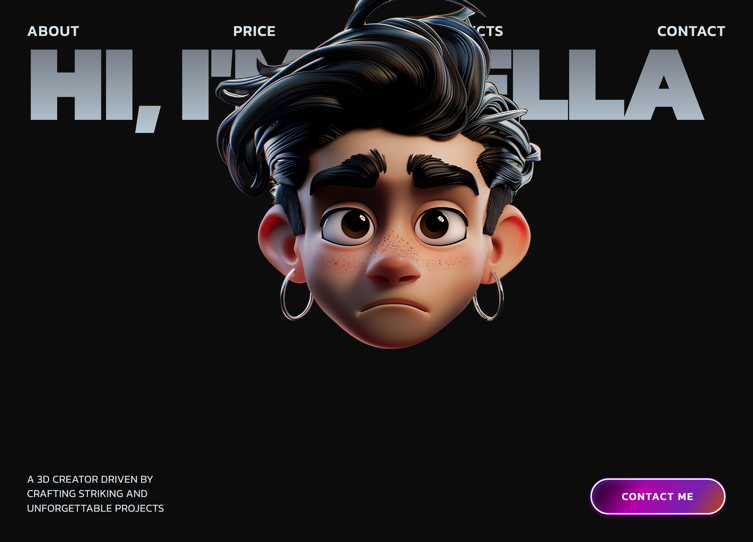

# 11 — Jack · 3D Creator

Portfolio personal de 5 secciones para un 3D creator. Tema oscuro `#0C0C0C` con tipografía Kanit (300–900) y gradient text (`linear-gradient(180deg, #646973 0%, #BBCCD7 100%)`) clipeado sobre los headings. Combina varias técnicas: magnet hover, marquee con parallax scroll, char-by-char reveal por scroll, números gigantes en lista de servicios, y stacking de project cards sticky con scale-on-scroll.

## 🖼️ Preview



## 🧱 Tecnologías

Vía **CDN**, sin build step. Adaptación de la spec original (React + Vite + TS + Tailwind + framer-motion + lucide-react) al formato del catálogo.

- **Tailwind CSS** (CDN runtime)
- **React 18.3.1** (UMD dev)
- **Babel Standalone 7.29.0**
- **Framer Motion 11.11.17** (UMD → `window.Motion`)
- **Google Fonts**: Kanit (300/400/500/600/700/800/900)

## 🎨 Sistema de diseño

- **Fondo global**: `#0C0C0C` (html, body, #root, main).
- **Texto base**: `#D7E2EA` (greyish-blue).
- **Heading gradient** (`.hero-heading`):
  ```css
  background: linear-gradient(180deg, #646973 0%, #BBCCD7 100%);
  -webkit-background-clip: text;
  -webkit-text-fill-color: transparent;
  ```
- **Tipografía**: Kanit. Headings `font-black uppercase tracking-tight leading-none`. Headings principales `clamp(3rem, 12vw, 160px)`.
- **`ContactButton`**: pill con gradient diagonal `linear-gradient(123deg, #18011F 7%, #B600A8 37%, #7621B0 72%, #BE4C00 100%)`, inset shadow rosa, outline blanco 2px offset -3px.
- **`LiveProjectButton`**: pill ghost con border 2px `#D7E2EA`, hover `bg-[#D7E2EA]/10`.

## 🧩 Las 5 secciones

### 1. Hero
- Navbar (4 links: About / Price / Projects / Contact) con FadeIn `y:-20`.
- H1 gigante `"Hi, i'm jack"` con gradient clipeado, `text-[14vw]` → `lg:text-[17.5vw]`, `whitespace-nowrap`.
- Retrato absolutamente centrado dentro de `<Magnet>` (padding 150, strength 3).
- Bottom bar: párrafo descriptivo izquierda + `<ContactButton>` derecha.
- FadeIn stagger: nav 0 / heading 0.15 / left text 0.35 / button 0.5 / portrait 0.6.

### 2. Marquee
- 21 GIFs de motionsites.ai en 2 rows, cada una triplicada para loop seamless.
- Listener `scroll` calcula `offset = (scrollY - sectionTop + innerHeight) * 0.3`.
- Row 1 (11 gifs) avanza a la derecha: `translateX(offset - 200)`.
- Row 2 (10 gifs) avanza a la izquierda: `translateX(-(offset - 200))`.
- Tiles 420×270, `rounded-2xl`, `object-cover`, `loading="lazy"`, `willChange: transform`.

### 3. About
- 4 imágenes 3D en las esquinas (moon / p59 / lego / Group_134) con FadeIn desde fuera (`x: ±80`).
- Heading "About me" gradient gigante.
- **`<AnimatedText>`**: 237 caracteres, cada uno con `useTransform(scrollYProgress, [start, end], [0.2, 1])` para un reveal carácter a carácter al hacer scroll. Offset `['start 0.8', 'end 0.2']`.
- `<ContactButton>` debajo.

### 4. Services
- Fondo blanco `#FFFFFF` con esquinas superiores redondeadas `rounded-t-[40/50/60]px`.
- Heading "Services" en negro.
- 5 items en lista vertical (max-w-5xl): número gigante a la izquierda (`clamp(3rem, 10vw, 140px)`), nombre uppercase + descripción light a la derecha. Borders horizontales `rgba(12,12,12,0.15)`.
- Stagger FadeIn: cada item `delay: i * 0.1`.

### 5. Projects (sticky stacking — corazón animado)
- Fondo `#0C0C0C` con esquinas superiores redondeadas, **pulled up** `-mt-10 sm:-mt-12 md:-mt-14` para que se solape sobre la sección anterior blanca.
- Heading "Project" (singular) gradient.
- 3 `<ProjectCard>` apilándose: cada card vive dentro de un slot `h-[85vh] sticky` con `top: index * 28px`. Dentro hay un `motion.div sticky top-24 md:top-32` que aplica `scale` derivado de `useScroll({ target: cardRef, offset: ['start start', 'end start'] })`:
  ```js
  targetScale = 1 - (totalCards - 1 - index) * 0.03;
  scale = useTransform(scrollYProgress, [0, 1], [1, targetScale]);
  ```
  → Cards anteriores se escalan a 0.94/0.97/1.0 mientras pasas a la siguiente.
- Cada card: número gigante gradient + categoría + nombre + LiveProjectButton, y un grid 40/60 de imágenes con `rounded-[60px]`.

## ⚙️ Componentes reutilizables

- **`FadeIn`** — wrapper Framer Motion con `whileInView`, `viewport: { once, margin: '50px', amount: 0 }`. Easing custom `[0.25, 0.1, 0.25, 1]`. Acepta `as` (Tag), `delay`, `duration` (0.7), `x`, `y` (30).
- **`Magnet`** — efecto magnético al cursor. Tracks mouse en window. Si está dentro de `padding` del bounding box, aplica `translate3d(dx/strength, dy/strength, 0)`. Transición distinta para entrar (`0.3s ease-out`) y salir (`0.6s ease-in-out`). `willChange: transform`.
- **`AnimatedText`** + **`Char`** — char-by-char scroll reveal. Cada char: placeholder invisible + motion.span absoluto con opacity animada por `useTransform`.
- **`ContactButton`** / **`LiveProjectButton`** — pills con sus estilos exactos.

## ▶️ Cómo usarla

1. Abrir `index.html` directamente o vía el viewer del catálogo.
2. Sin `npm install`, sin build.
3. Los assets vienen de Figma (`shrug-person-78902957.figma.site`), `motionsites.ai` y `images.higgs.ai`. Si alguno cae, sustituir las URLs en los `const` del top del script.
4. **Mouse magnet** y **scroll animations** sólo se ven con la pestaña en foreground (Chrome throttlea rAF/scroll listeners en background).

## 📝 Notas / Pendientes

- [x] Añadir `preview.png` (Captura de pantalla 2026-05-13 160449 — Projects sticky-stacking con cards 02 "Aura Brand Identity" y 03 "Solaris Digital" apiladas, mostrando el efecto scale-on-scroll en acción)
- [ ] Validar el `AnimatedText` en navegadores móviles (iOS Safari ha tenido bugs con `useScroll` sobre elementos pequeños).
- [ ] En desktop el portrait del hero hace `translate(-50%, -50%)` por inline style; el Magnet lo overrides cuando entra el cursor — el reset al salir vuelve al `translate3d(0,0,0)` y pierde el centrado. Posible fix: aplicar el centrado al wrapper padre del Magnet (ya hecho parcialmente).
- [ ] El catálogo (viewer) carga la plantilla en iframe — verificar que el scroll del iframe alimenta correctamente `useScroll` en Framer Motion.

## 🔧 Assets

Los GIFs del grid vienen de `motionsites.ai`. Uno de ellos (`hero-celestia-preview-0yO3jXO8.gif`) empezo a devolver 404, asi que se recupero desde el Internet Archive y se guarda en local como `hero-celestia-preview.gif`. Aparece 3 veces en el grid y llevaba `loading="lazy"`, por lo que el fallo solo se veia al hacer scroll.
