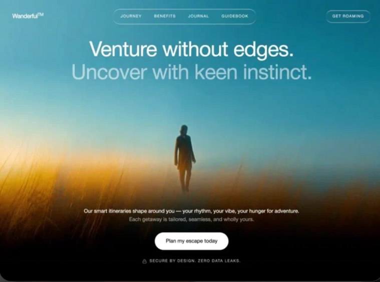

# 12 — Wanderful · Venture without edges

Hero único fullscreen para una marca de viajes. Vídeo cinemático a `playbackRate: 1.25` con parallax sutil al cursor (gsap), nav pill `liquid-glass` central, headline en dos líneas (blanco + `white/55`), párrafo justificado, CTA blanco prominente con glow al hover y badge de seguridad con Lock icon.

## 🖼️ Preview



## 🧱 Tecnologías

Vía **CDN**, sin build step. Adaptación de la spec original (React + Vite + TS + Tailwind + gsap + lucide-react) al formato del catálogo.

- **Tailwind CSS** (CDN runtime)
- **React 18.3.1** (UMD dev)
- **Babel Standalone 7.29.0**
- **GSAP 3.12.5** (UMD → `window.gsap`)
- **Google Fonts**: Instrument Serif + Barlow (300/400/500/600) + Inter (300/400/500/600/700)
- **Dirtyline** vía `fonts.cdnfonts.com` (cargada pero no usada en el hero — disponible)
- **Iconos lucide** (`Lock`) inline con los paths exactos

## 🎨 Sistema de diseño

- **Fondo**: negro puro `#000`. Body en **Barlow** (300–600). Hero headings en **Inter** vía `style.fontFamily` inline.
- **Liquid-glass** (variante sutil con blur 4px y máscara gradiente top/bottom) en nav pill y CTA derecho.
- **Color del texto**:
  - Blanco: headline line 1, primer fragmento del párrafo, etiqueta del botón.
  - `rgba(255,255,255,0.55)`: headline line 2, segundo fragmento del párrafo.
  - `rgba(255,255,255,0.70)`: badge SECURE BY DESIGN.
- **Headline**: Inter 400, `clamp(40px, 5.4vw, 72px)`, `line-height: 1.1`, `letter-spacing: -0.02em`.
- **CTA principal**: pill blanca, texto negro, hover `scale-[1.03]` + glow `0 0 32px 4px rgba(255,255,255,0.2)`, active `scale-[0.97]`.

## 🧲 Parallax con GSAP

```
strength = 20  →  -20…+20 px de offset máximo
mousemove  →  targetX = ((clientX - vw/2) / (vw/2)) * 20
each frame →  currentX += (targetX - currentX) * 0.06
              gsap.set(videoBgRef, { x: currentX, y: currentY })
```

El contenedor del vídeo tiene `scale-[1.08]` para que el parallax no muestre bordes. gsap preserva el scale al setear `x/y` — verificado: `translate(8px, -4px) scale(1.08, 1.08)`.

## ⚙️ Detalles del vídeo

- Source desde CloudFront (no se necesita descarga local — no se hace `drawImage` a canvas → no hay CORS).
- `onLoadedMetadata` ajusta `playbackRate = 1.25` para dar un sutil empuje cinemático.
- `autoPlay muted loop playsInline` y `object-cover` para que rellene el viewport.

## 🧩 Estructura JSX

```
<div min-h-screen bg-black overflow-x-hidden>
  ├─ <div fixed inset-0 z-0 scale-[1.08]>   (videoBgRef)
  │    └─ <video src=VIDEO autoPlay muted loop playsInline>
  ├─ <header fixed top-0 z-50 px-10 py-8 flex justify-between>
  │    ├─ Wordmark "Wanderful<sup>TM</sup>"  (font-semibold 17px)
  │    ├─ <nav liquid-glass pill> 4 links (JOURNEY/BENEFITS/JOURNAL/GUIDEBOOK)
  │    └─ "GET ROAMING" (liquid-glass pill)
  ├─ <div fixed top: 120px z-20> (fade-in mounted)
  │    ├─ <h1 white> Venture without edges.
  │    └─ <h1 white/55> Uncover with keen instinct.
  └─ <div fixed bottom: 56px z-20> (fade-in mounted + delay-300)
       ├─ <p> párrafo bifásico
       ├─ <button> Plan my escape today
       └─ <div> Lock icon + SECURE BY DESIGN. ZERO DATA LEAKS.
```

## ▶️ Cómo usarla

1. Abrir `index.html` directamente o vía el viewer del catálogo.
2. Sin `npm install`, sin build.
3. El vídeo viene de CloudFront — si cae, sustituir `VIDEO_SRC`.
4. El parallax funciona moviendo el cursor (en móvil sin mouse, el vídeo queda quieto centrado — aceptable).

## 📝 Notas / Pendientes

- [x] Añadir `preview.png` (Captura de pantalla 2026-05-13 161217 — figura caminando en campo dorado al atardecer con headline cinemático)
- [ ] En el viewer del catálogo (iframe), el `mousemove` se dispara dentro del iframe — verificar que el parallax es notable o si conviene escuchar también en `window.parent`.
- [ ] El gradiente blanco→transparente del párrafo bifásico se podría reforzar con un `mix-blend-mode` si se valida visualmente.
