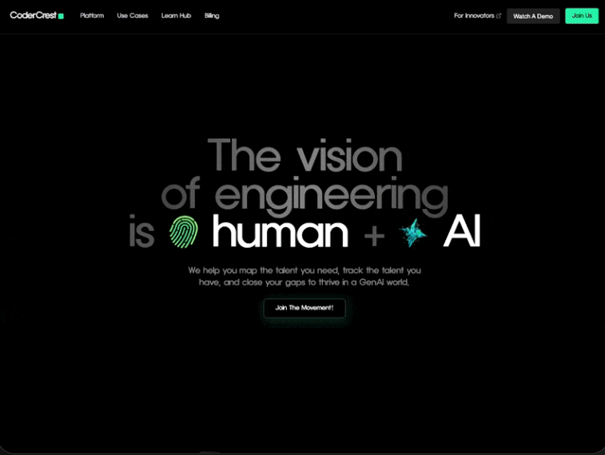

# 13 — The vision of engineering is human + AI

Hero único fullscreen para una plataforma de talent/HR con narrativa de IA. Background con stream **HLS** reproducido vía `hls.js`, headline en 3 líneas con gradiente clipeado al texto y dos **iconos circulares de vídeo** (human + AI) embebidos en línea con el copy. CTA negro con glow verde menta y outline `#30463C`.

## 🖼️ Preview



## 🧱 Tecnologías

Vía **CDN**, sin build step. Adaptación de la spec original (React + TS + Tailwind + hls.js) al formato del catálogo.

- **Tailwind CSS** (CDN runtime)
- **React 18.3.1** (UMD dev)
- **Babel Standalone 7.29.0**
- **hls.js 1.5.15** (UMD → `window.Hls`) para reproducir HLS en navegadores que no lo soportan nativamente
- **Sin Google Fonts**: el spec pide `YDYoonche L/M` (fuente coreana propietaria). En esta versión cae al sistema sans-serif — si tienes acceso a esa fuente, declararla en `@font-face` antes del cuerpo del documento.

## 📺 HLS playback

El vídeo de fondo es un stream **Mux** `.m3u8`:

```
https://stream.mux.com/tLkHO1qZoaaQOUeVWo8hEBeGQfySP02EPS02BmnNFyXys.m3u8
```

Pipeline:

1. `Hls.isSupported()` → crear `new Hls({ autoStartLoad: true })`, `loadSource(HLS_SRC)`, `attachMedia(video)`, y en `MANIFEST_PARSED` llamar a `video.play()`.
2. Fallback nativo: si el navegador soporta `application/vnd.apple.mpegurl` (Safari/iOS), asignar `video.src = HLS_SRC` directamente.
3. Cleanup: `hls.destroy()` en unmount.

Verificado en preview: `window.Hls` cargado, `isSupported() = true`, `video.readyState = 4`. hls.js reescribe el `src` al segmento parseado del manifest (`…acb02146-11de-42e5-…`).

## 🎨 Sistema de diseño

- **Fondo**: negro puro `#000` (section + body).
- **Tipografía**: `'YDYoonche L', 'YDYoonche M', sans-serif` con peso 300. Fallback al sistema en esta plantilla.
- **Heading**: `clamp(2.2rem, 7vw, 6.5rem)`, `lh 1.1`, `letter-spacing: -0.01em`.
- **Gradient text** en las dos primeras líneas:
  ```css
  background: linear-gradient(90deg, #666666 0%, #d0d0d0 50%, #666666 100%);
  -webkit-background-clip: text;
  -webkit-text-fill-color: transparent;
  ```
  Genera el característico texto plateado con highlight central.
- **Subtítulo**: `#ccc`, `clamp(0.95rem, 2.2vw, 1.2rem)`, `lh 1.4`.
- **CTA negro**: outline `1px solid #30463C` (verde oscuro), shadow base `0px 6px 24px 6px rgba(39,243,169,0.15)` (glow menta sutil), hover potenciado a `0px 6px 32px 8px rgba(39,243,169,0.22)` + `scale-[1.03]`, active `scale-[0.98]`.

## 🧩 Estructura JSX

```
<section h-100vh bg-black relative overflow-hidden flex-col>
  ├─ <video> HLS bg (zIndex 0, object-cover, fullscreen)
  └─ <div content marginTop: 380 z-10>
       ├─ <h1>
       │    ├─ <span gradient> "The vision"
       │    ├─ <span gradient> "of engineering"
       │    └─ <span flex items-center gap-3 flex-wrap>
       │         ├─ "is" (color #999)
       │         ├─ <VideoIcon src=VIDEO_HUMAN size=110>
       │         ├─ "human"
       │         ├─ "+" (color #999, top: 0.15em)
       │         ├─ <VideoIcon src=VIDEO_AI size=110>
       │         └─ "AI"
       ├─ <p subtítulo>
       └─ <button CTA>
```

### `VideoIcon` (componente reutilizable)

Wrapper `<span class="inline-block align-middle rounded-full overflow-hidden">` con `width`/`height` = `clamp(48px, 10vw, ${size}px)`. Dentro un `<video autoPlay loop muted playsInline>` con `object-fit: cover`. Reproduce dos MP4s distintos (uno humano, otro AI) en círculos dentro del heading — efecto visual muy característico.

## ▶️ Cómo usarla

1. Abrir `index.html` directamente o vía el viewer del catálogo.
2. Sin `npm install`, sin build.
3. Los videos auto-play muted (necesario por políticas de autoplay del navegador).
4. El stream HLS y los MP4 vienen de Mux + CloudFront — si caen, sustituir `HLS_SRC`, `VIDEO_HUMAN`, `VIDEO_AI`.

## 📝 Notas / Pendientes

- [x] Añadir `preview.png` (Captura de pantalla 2026-05-13 162939 — heading completo "The vision / of engineering / is [👆] human + [✦] AI" con los dos iconos circulares visibles y el CTA con glow verde)
- [ ] Si dispones de la fuente **YDYoonche L/M**, añadirla con `@font-face` en el `<style>` del documento. Sin ella, el heading usa sans-serif del sistema.
- [ ] El `marginTop: 380` está hardcoded — en móvil empuja el contenido fuera de pantalla. Considera un `clamp(80px, 30vh, 380px)` para mejor responsive si quieres ajustarlo.
- [ ] El glow verde del CTA queda muy sutil. Si quieres potenciarlo, subir la opacity base de 0.15 a 0.25.
