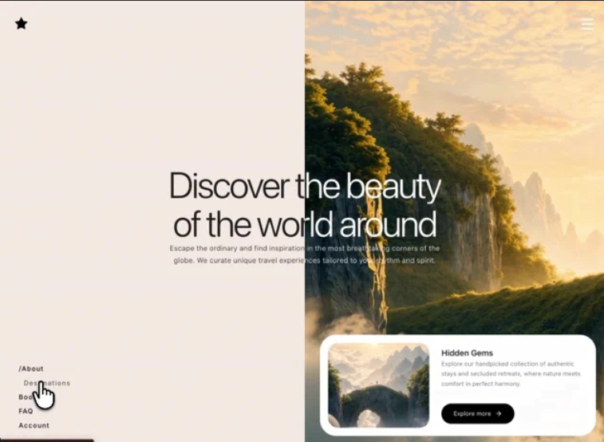

# 14 — Travel · Discover the World

Concepto **luxury travel** multi-página con 3 rutas (Home, Destinations, Tour Detail) más 404. La spec original es **Next.js 16 App Router**; aquí adaptamos al formato del catálogo con **hash routing** dentro de un único HTML.

Lo más vistoso: el **Hero split-screen** donde el mismo headline aparece dos veces con clip-path opuesto (negro a la izquierda sobre fondo crema, blanco a la derecha sobre vídeo), creando una composición simétrica perfectamente alineada.

## 🖼️ Preview

## 🧱 Tecnologías

Vía **CDN**, sin build step. Adaptación de la spec Next.js 16 al formato del catálogo.

- **Tailwind CSS** (CDN runtime)
- **React 18.3.1** (UMD dev) — vs. la spec original con React 19.2
- **Babel Standalone 7.29.0**
- **Framer Motion 11.11.17** (UMD → `window.Motion`)
- **Google Fonts**: Inter (300/400/500)
- **Iconos lucide** (Star, Menu, X, ArrowRight, ArrowLeft) inline con paths exactos
- **Hash routing** propio (`useHashRoute` + `<Link>`) en lugar del App Router de Next

## 🗺️ Rutas

| Hash | Vista | Render |
|---|---|---|
| `#/` (vacío) | **Home** | `<HeroSection>` — split-screen con vídeo y gem card |
| `#/destinations` | **Destinations** | `<DestinationsSection>` — buscador + galería horizontal 7 tours |
| `#/destinations/<id>` | **Tour Detail** | `<TourDetailSection>` — bg fullscreen + info card |
| cualquier otra | **404** | `<NotFound>` con Back to home |

Los `<Link>` interceptan clicks y hacen `window.location.hash = newPath`, disparando `hashchange` y el re-render. El back/forward del navegador funciona nativamente.

## 🎨 Sistema de diseño

- **Color base**: cream `#f3ebe4` para fondos y card del tour-detail.
- **Tipografía**: Inter (300/400/500) en todo el sitio.
- **Selection**: negro sobre blanco.
- **goldEase**: `[0.76, 0, 0.24, 1]` — easing usado en todas las animaciones (entrada de cards, slides del menú, fade-ups…).
- **Border radius**: `32px` (gem card), `20px` (info card, gem image, thumbnails), `24px` (book button), `2xl` (tour images).

## 🧩 Cada vista

### 1. Hero (`/`)
- `.hero-container` split 50/50 (`left-bg` cream + `right-bg` con vídeo).
- Vídeo de fondo `object-cover object-left` con motion scale 1.06 → 1 (2.2s).
- `useEffect` defensivo: fuerza `muted = true` y reintenta `play()` en `loadeddata` (esquiva las restricciones de autoplay).
- **Texto split**: dos copias del `<HeroContent>` con clip-paths opuestos (`inset(0 50% 0 0)` negro, `inset(0 0 0 50%)` blanco) que se superponen píxel-perfect. En <850px sólo se muestra la versión blanca.
- **Gem card** `<motion.div>` en la esquina inferior derecha con su propio vídeo, título "Hidden Gems", descripción y CTA pill negro "Explore more →".

### 2. Destinations (`/destinations`)
- Input central placeholder "Find your tour" tamaño `clamp(24px, 4vw, 42px)` — filtra los tours por `name.toLowerCase().includes(query)`.
- Label "Popular" + galería horizontal scroll con 7 tour cards.
- **Primer card** (`cold-islands-norway`) usa un `<video>` paused con `#t=0.1` como still frame.
- Otros 6 usan `` de Picsum. Cada card tiene su `tour.imgH` y `tour.w` (anchos variables).
- Empty state si la búsqueda no matchea.

### 3. Tour Detail (`/destinations/:id`)
- Bg motion scale 1.06 → 1.
- Si `tour.video` existe (sólo `cold-islands-norway`): vídeo full-bleed **sin overlay ni brightness filter**. Si no, imagen con `brightness-90` + overlay sutil.
- **Info card** lateral (`#infocard`, max-w 400, bg `#f3ebe4`, shadow-2xl) con:
  - Back link (ArrowLeft + "Back to explore")
  - H1 con el nombre del tour
  - Descripción
  - Friends row con 3 avatares apilados + chip `+N` negra + "{N} friends been there"
  - 3 info rows (Avg cost, Best time, Visa con flag 🇪🇺)
  - Grid 3×3 de thumbnails con `group-hover:scale-110`
  - **Book btn** negro pill (`whileHover={{ y: -2 }}`)

### 4. Navbar (compartido en todas las vistas)
- **Star icon** top-left con color condicional:
  - Menu abierto → negro
  - Tour detail → blanco
  - Home → negro desktop / blanco mobile (vía `min-[851px]:text-black max-[850px]:text-white`)
  - Resto → negro
- **Hamburger** top-right que abre un overlay full-screen blanco con stagger de los links (delay `0.3 + i*0.07`).
- **Desktop nav** bottom-left fijo (oculto en `<851px` y oculto en tour-detail), con 5 links y prefijo `/` para la ruta activa.

## 🖼️ Assets

- **3 vídeos CloudFront** (URLs exactas verificadas):
  1. Hero bg: `…0148805d9fb9.mp4`
  2. Gem card: `…163eb46466e8.mp4`
  3. Cold Islands Norway: `…6eb4af170352.mp4`
- **10 imágenes** de Picsum con IDs travel-themed (`1018, 1036, 1019, 1043, 1015, 1051, 1003, 133, 1059, 1060`). En el repo original son `public/img1.jpg`…`img10.jpg` y el usuario las sustituye por sus propias fotografías.

## ▶️ Cómo usarla

1. Abrir `index.html` directamente o vía el viewer del catálogo (URL `#/`).
2. Navegar con los enlaces del menú o cambiando manualmente el hash.
3. Sin `npm install`, sin build.

## 📝 Notas / Pendientes

- [x] Añadir `preview.png` (Captura de pantalla 2026-05-13 165954 — Hero split-screen con texto "Discover the beauty / of the world around" superpuesto perfectamente entre la mitad cream (negro) y la mitad con vídeo de cascada (blanco), gem card "Hidden Gems" bottom-right, Star top-left, desktop nav bottom-left)
- [ ] Las 10 imágenes vienen de Picsum (semillas fijas, fotos consistentes pero no curated). Sustituir por fotos reales de viaje si vas a deployear.
- [ ] La spec original es **Next.js 16 App Router** con rutas server-side (`app/destinations/[id]/page.tsx`). Esta versión usa hash routing client-side, que es funcionalmente equivalente para una demo estática.
- [ ] No se incluye la página `/booking` ni `/faq` ni `/account` — son routes definidos en la nav pero la spec no detalla su contenido. Caen al `<NotFound>`.
