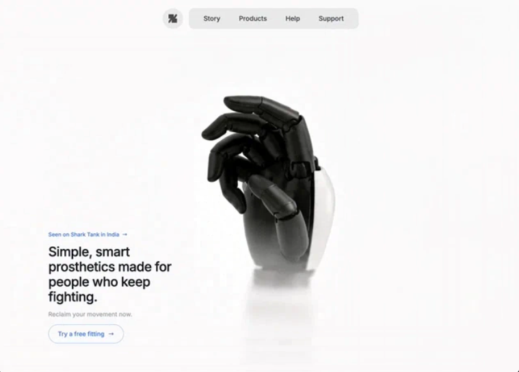

# 16 — Simple, smart prosthetics

Hero único minimalista para una marca de prótesis (referenciando Shark Tank India). Vídeo de fondo, **navbar centrada en dos pills separadas** (logo circular + links horizontal), y bloque de copy bottom-left con badge azul, headline, subtítulo y CTA outline que se rellena en hover. Ningún framework de animación: todo CSS transitions de Tailwind.

## 🖼️ Preview



## 🧱 Tecnologías

Vía **CDN**, sin build step. Adaptación de la spec original (React + TS + Vite + Tailwind + lucide-react) al formato del catálogo.

- **Tailwind CSS** (CDN runtime)
- **React 18.3.1** (UMD dev)
- **Babel Standalone 7.29.0**
- **Sin Google Fonts**: stack sans-serif del sistema (per spec)
- **Sin lucide-react**: el spec lo lista como permitido pero ningún icono se usa (sólo flechas Unicode `→`)

## 🎨 Sistema de diseño

- **Fondos**: page `#f0f0ee`, pills `#EDEDED`.
- **Texto**: H1 en `gray-900`, links nav en `gray-700 → gray-900` hover, subtítulo `gray-400`, badge/CTA en azul (`blue-500/600/400`).
- **Tipografía**: stack sans-serif del sistema. Tamaños exactos: `11.5px` (badge), `12px`/`14px` (nav), `13px` (subtítulo, CTA), `1.5rem`/`1.75rem` (H1).
- **Logo**: SVG inline `18×18` viewBox `0 0 256 256` con un solo path stilizado fill `rgb(84, 84, 84)`.

## 🧩 Estructura

```
<div min-h-screen bg-[#f0f0ee] overflow-hidden>
  ├─ <video> fullscreen absolute (z-0)
  └─ <div z-10 flex-col min-h-screen>
       ├─ <nav pt-6 px-8 flex justify-center gap-3>
       │     ├─ logo pill rounded-full w-11 h-11 bg-#EDEDED
       │     │     └─ <Logo /> (SVG inline)
       │     └─ links pill rounded-xl px-8 py-3 bg-#EDEDED
       │           └─ 4 links: Story / Products / Help / Support
       └─ <div flex-1 flex items-end pb-16 px-20>
            └─ <div max-w-xs>
                 ├─ Badge blue-500 "Seen on Shark Tank in India →"
                 ├─ H1 gray-900 medium "Simple, smart prosthetics made for people who keep fighting."
                 ├─ Subtítulo gray-400 "Reclaim your movement now."
                 └─ CTA outline blue "Try a free fitting →" (hover llena en azul)
```

## ⚡ Micro-interacciones

- **Arrow translate**: cada `→` está en un `<span class="group-hover:translate-x-0.5">` que se desliza 2px a la derecha cuando el padre `group` está en hover. 200ms.
- **CTA fill**: outline blue → bg-blue-500 + text-white + border-blue-500 en hover. `transition-all 200ms`.
- **Nav links**: `gray-700 → gray-900` con `transition-colors 200ms`.
- **Badge link**: `blue-500 → blue-600` con `transition-colors`.

## ▶️ Cómo usarla

1. Abrir `index.html` directamente o vía el viewer del catálogo.
2. Sin `npm install`, sin build.
3. El vídeo está en CloudFront — si cae, sustituir `VIDEO_SRC`.

## 📝 Notas / Pendientes

- [x] Añadir `preview.png` (Captura de pantalla 2026-05-14 084441 — mano protésica negra articulada en pose elegante sobre fondo cream, navbar twin-pill arriba, bloque de copy bottom-left con badge azul y CTA outline)
- [ ] El layout es 100% responsive vía Tailwind (sm/lg breakpoints en padding y tamaños). Validar en móvil real si quieres ajustar el `max-w-xs` del bloque de copy.
- [ ] El vídeo se reproduce raw sin overlay — si el copy queda con poca legibilidad sobre algún frame, considerar añadir un overlay sutil tipo `bg-white/30` o `bg-gradient-to-r from-white/50` por la izquierda.
