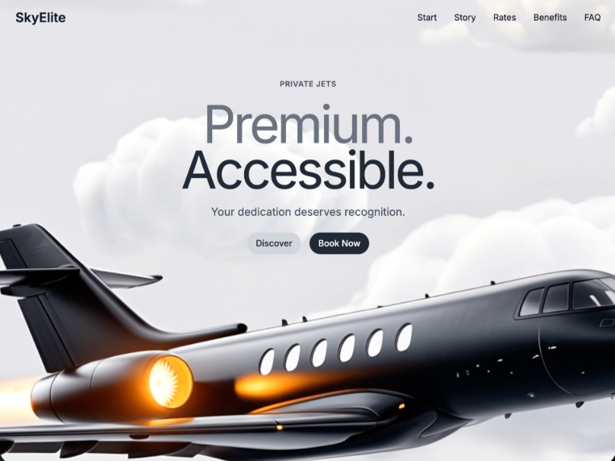

# 17 — SkyElite · Premium. Accessible.

Hero único premium para una marca de jets privados. Vídeo de fondo, navbar con brand wordmark + 5 links + hamburguesa móvil (dropdown blur), y heading central con **dos líneas solapadas** vía margin-top negativo (Premium en gris pálido sobre Accessible en azul-negro `#202A36`).

## 🖼️ Preview



## 🧱 Tecnologías

Vía **CDN**, sin build step. Adaptación de la spec original (React + TS + Tailwind + lucide-react) al formato del catálogo.

- **Tailwind CSS** (CDN runtime)
- **React 18.3.1** (UMD dev)
- **Babel Standalone 7.29.0**
- **Google Fonts**: Inter (400/500/600/700)
- **Iconos lucide** (Menu, X) inline con paths exactos

## 🎨 Sistema de diseño

- **Page bg**: `bg-gray-50` (`#f9fafb`).
- **Brand**: gray-900, font-semibold, 2xl.
- **Nav links**: gray-900 → gray-700 hover.
- **Heading**:
  - Line 1 "Premium." en gray-500 (`#6b7280`)
  - Line 2 "Accessible." en `#202A36` con `margin-top: -12px` (overlap perfecto)
  - Tamaño responsive `text-6xl md:text-7xl lg:text-8xl`, `font-normal`, `leading-none`, `tracking-tighter`
- **Eyebrow**: "PRIVATE JETS" gray-600, font-semibold, tracking-wider, text-sm uppercase.
- **Subtitle**: gray-600, text-lg md:text-xl.
- **Botones**:
  - "Discover" → bg-gray-300, text-gray-800, hover bg-gray-400
  - "Book Now" → bg `#202A36`, text white, hover `#1a2229`

## 🧩 Estructura

```
<div min-h-screen bg-gray-50>
  └─ <section relative h-screen overflow-hidden>
       ├─ <video> fullscreen absolute (z-0)
       └─ <div relative z-10 h-full flex-col>
            ├─ <nav max-w-7xl mx-auto px-8 py-6 flex justify-between>
            │     ├─ "SkyElite" wordmark
            │     ├─ <ul hidden md:flex gap-8> 5 links
            │     └─ <button md:hidden> hamburger (Menu/X toggle)
            ├─ (when menuOpen) <div md:hidden> dropdown blur con 5 links
            └─ <div flex-1 flex items-center justify-center>
                 └─ <div text-center -mt-80>
                      ├─ Eyebrow "PRIVATE JETS"
                      ├─ <h1>
                      │     ├─ <span> "Premium." gray-500
                      │     └─ <span margin-top:-12> "Accessible." #202A36
                      ├─ Subtítulo
                      └─ 2 CTAs pill
```

## ⚡ Interacciones

- **Hamburger toggle**: `useState(menuOpen)`. Cuando abierto muestra dropdown `bg-white/95 backdrop-blur rounded-2xl shadow-lg`. Al click en link se cierra.
- **Hover de nav links**: `transition-colors` 200ms gray-900 → gray-700.
- **CTAs**: transición de color background al hover (handled inline para Book Now porque usa hex custom).

## ▶️ Cómo usarla

1. Abrir `index.html` directamente o vía el viewer del catálogo.
2. Sin `npm install`, sin build.
3. El vídeo está en CloudFront — si cae, sustituir `VIDEO_SRC`.

## 📝 Notas / Pendientes

- [x] Añadir `preview.png` (Captura de pantalla 2026-05-14 085900 — jet privado negro cruzando nubes con headline "Premium. / Accessible." en overlap perfecto, navbar SkyElite arriba, CTAs Discover/Book Now)
- [ ] El `-mt-80` pull-up está calculado para desktop con `h-screen` ≥ 800px. En viewport pequeño puede empujar el bloque demasiado arriba — considerar `lg:-mt-80` y dejarlo neutro en mobile si se valida.
- [ ] El overlap de las 2 líneas del H1 (`margin-top: -12px`) funciona bien con `text-6xl/7xl/8xl` y `leading-none`. Si cambias la fuente o tamaño, ajustar ese offset proporcionalmente.
