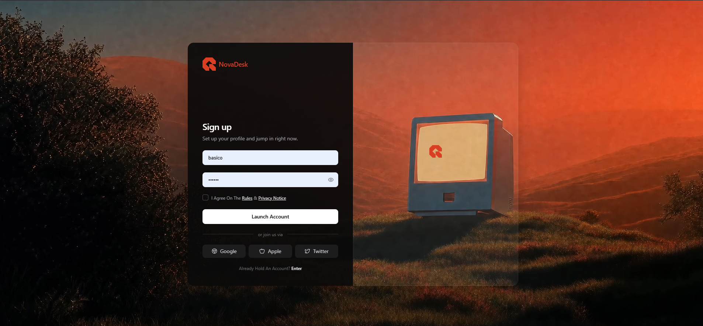

# 18 — NovaDesk · Sign up

Página de **sign-up** premium con card 2-columnas centrada sobre un vídeo de fondo. Columna izquierda con form oscuro (email + password con toggle de visibilidad, checkbox custom, CTA blanco "Launch Account" y 3 social logins) y columna derecha glass con logo flotante.

## 🖼️ Preview



## 🧱 Tecnologías

Vía **CDN**, sin build step. Adaptación de la spec original (React + TS + Vite + Tailwind + lucide-react) al formato del catálogo.

- **Tailwind CSS** (CDN runtime)
- **React 18.3.1** (UMD dev)
- **Babel Standalone 7.29.0**
- **Sin Google Fonts**: stack sans-serif del sistema (per spec)
- **Iconos lucide** (Eye, EyeOff, Chrome, Apple, Twitter) inline con paths exactos

## 🎨 Sistema de diseño

- **Brand**: `#DA3F23` (rojo-naranja característico). Usado en el logo SVG y en el wordmark "NovaDesk".
- **Superficies**:
  - Page bg `black`.
  - Left col: `rgba(10, 10, 10, 0.92)` (oscuro casi opaco).
  - Right col: `rgba(255, 255, 255, 0.05)` con border `rgba(255, 255, 255, 0.08)` (panel glass sobre el vídeo).
  - Inputs: `bg-zinc-800/70`. Social buttons: `bg-zinc-800/60` → hover `bg-zinc-700/60`.
- **Texto**: white, `zinc-200`, `zinc-300`, `zinc-400`, `zinc-500`.
- **Tipografía**: stack sans-serif del sistema. Heading `font-semibold` (600), brand `font-semibold`, demás `font-medium` o normal.

## 🧩 Estructura

```
<div min-h-screen flex items-center justify-center sm:h-screen>
  ├─ <video> fullscreen absolute (z-0)
  └─ <div max-w-4xl rounded-2xl flex flex-col sm:flex-row sm:h-[660px] z-10>
       ├─ Left col w-1/2 px-10 py-10 bg-rgba(10,10,10,0.92)
       │     ├─ Brand: <BrandLogo size=36 /> + "NovaDesk" #DA3F23
       │     └─ <form gap-5 mt-auto>
       │           ├─ H1 "Sign up" + subtítulo
       │           ├─ Email input bg-zinc-800/70
       │           ├─ Password input + Eye/EyeOff toggle
       │           ├─ Checkbox custom + "I Agree On The Rules & Privacy Notice"
       │           ├─ Submit "Launch Account" white pill
       │           ├─ Divider "— or join us via —"
       │           ├─ 3 social buttons (Chrome/Apple/Twitter)
       │           └─ Footer "Already Hold An Account? Enter"
       └─ Right col w-1/2 hidden sm:flex (glass panel)
             └─ <BrandLogo size=34> con marginTop: -70px
```

## 🔘 Componentes

- **`BrandLogo`** — SVG inline con el path stylized del logo, fill configurable. Reutilizado en brand lockup y en panel glass.
- **`Eye` / `EyeOff`** — lucide. Toggle de visibilidad del password via `useState(showPassword)`.
- **`Chrome` / `Apple` / `Twitter`** — lucide para los 3 social logins.
- **`CheckMark`** — SVG simple para el check negro dentro del checkbox custom cuando `agreed=true`.
- **Custom checkbox** — native `<input type="checkbox" className="sr-only">` envuelto en `<label>`, con un `<span>` 16×16 que cambia entre `border-zinc-600 bg-transparent` (unchecked) y `bg-white border-white` con el `<CheckMark>` (checked).

## ⚙️ State

```
const [email, setEmail] = useState('');
const [password, setPassword] = useState('');
const [agreed, setAgreed] = useState(false);
const [showPassword, setShowPassword] = useState(false);
```

Todo CSS transitions — sin keyframe animations. `transition-colors` en inputs, buttons, links, checkbox.

## ▶️ Cómo usarla

1. Abrir `index.html` directamente o vía el viewer del catálogo.
2. Sin `npm install`, sin build.
3. El vídeo está en CloudFront — si cae, sustituir `VIDEO_SRC`.

## 📝 Notas / Pendientes

- [x] Añadir `preview.png` (Captura de pantalla 2026-05-14 095515 — paisaje montañoso al atardecer con tonos rojizo-naranjas + TV antigua mostrando el logo NovaDesk, card sign-up centrada sobre el escenario)
- [ ] El form no hace nada al `onSubmit` (sólo `preventDefault`). Para conectar a Supabase, sustituir el handler por una llamada `supabase.auth.signUp`.
- [ ] En mobile (`<sm:640`) el panel glass derecho se oculta vía `hidden sm:flex`, y la card pasa a column con altura `auto` (la spec usa `sm:h-[660px]` que no aplica < 640px).
- [ ] El vídeo NO necesita descarga local (no se hace `drawImage` a canvas → no hay CORS).
