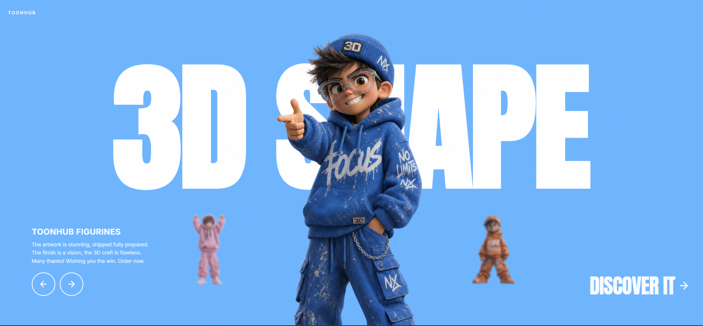

# 19 — TOONHUB · Figurines

Hero único con un **carrusel rotatorio de 4 figurines 3D**. Cada figurine ocupa uno de 4 roles (`center / left / right / back`) determinados módulo 4 desde el `activeIndex`. Al avanzar/retroceder, todos los roles rotan y los figurines se reposicionan/escalan/blurean en paralelo, mientras el background pasa por las 4 paletas (naranja, verde, rosa, azul) con un crossfade de 650ms `cubic-bezier(0.4, 0, 0.2, 1)`.

## 🖼️ Preview



## 🧱 Tecnologías

Vía **CDN**, sin build step. Adaptación de la spec original (React + TS + Vite + Tailwind + lucide-react) al formato del catálogo.

- **Tailwind CSS** (CDN runtime)
- **React 18.3.1** (UMD dev)
- **Babel Standalone 7.29.0**
- **Google Fonts**: Anton (display) + Inter 400/500/600/700 (body)
- **Iconos lucide** (ArrowLeft, ArrowRight) inline

## 🎯 La lógica de roles (corazón de la plantilla)

```ts
const center = activeIndex;
const left   = (activeIndex + 3) % 4;
const right  = (activeIndex + 1) % 4;
const back   = (activeIndex + 2) % 4;
```

Cada figurine se renderiza en posición/escala/blur según su rol actual:

| Rol | Posición | Escala | Blur | Opacity | z-index |
|---|---|---|---|---|---|
| **center** | `left: 50%, bottom: 0 (sm)` | `1.68` desktop / `1.25` mobile | 0px | 1 | 20 |
| **left** | `left: 30% (sm) / 20% (mobile)` | 1 | 2px | 0.85 | 10 |
| **right** | `left: 70% / 80%` | 1 | 2px | 0.85 | 10 |
| **back** | `left: 50%` (escondido detrás) | 1 | 4px | 1 | 5 |

Toda la transición (`transform / filter / opacity / left / bottom / height`) ocurre en 650ms con `cubic-bezier(0.4, 0, 0.2, 1)` simultáneamente — el efecto es como una "rueda" 3D con perspectiva pseudo-circular.

### Navigation
- `isAnimating` flag bloquea clicks durante 650ms tras cada navegación (previene desyncs).
- `navigate('next')` → `(prev + 1) % 4`
- `navigate('prev')` → `(prev + 3) % 4`
- Verificado en preview: clicks consecutivos rápidos son ignorados hasta que termina la animación.

## 🎨 Sistema de diseño

- **4 paletas** (una por figurine):
  - `#F4845F` (naranja terracota)
  - `#6BBF7A` (verde menta)
  - `#E882B4` (rosa)
  - `#6EB5FF` (azul cielo)
- **Ghost text "3D SHAPE"**: Anton, `clamp(90px, 28vw, 380px)`, blanco, `tracking-[-0.02em]`, detrás de los figurines (`z-index: 2`).
- **Grain overlay**: SVG fractalNoise `baseFrequency=0.9 numOctaves=4`, opacity 0.4, repeat 200×200 — añade textura sucia sobre todo el background.
- **Brand "TOONHUB"** top-left en `tracking-[0.18em]`.
- **CTA "DISCOVER IT"** bottom-right en Anton + ArrowRight.

## 🧩 Estructura

```
<div bg-{activeIndex.bg} transition-650>
  └─ <div h-100vh overflow-hidden>
       ├─ Grain overlay (z-50)
       ├─ "3D SHAPE" ghost text (z-2, top:18%, Anton clamp)
       ├─ Brand "TOONHUB" top-left (z-60)
       ├─ Carousel (z-3): 4 figurines mapeados con rol → style
       ├─ Bottom-left (z-60, max-w-320):
       │     ├─ "TOONHUB FIGURINES" tracking-widest
       │     ├─ Long description (hidden sm:block)
       │     └─ 2 nav buttons (Prev/Next circular)
       └─ Bottom-right (z-60): "DISCOVER IT" + ArrowRight (Anton)
```

## ⚡ Performance

- Las 4 imágenes se **preload** en mount via `new Image()` para que la rotación no tenga lag de carga.
- `willChange: transform, filter, opacity` en cada figurine para hint al compositor.

## ▶️ Cómo usarla

1. Abrir `index.html` directamente o vía el viewer del catálogo.
2. Sin `npm install`, sin build.
3. Clickar las flechas circulares bottom-left para rotar el carrusel.
4. Los assets vienen de `fifth-gentle-45902158.figma.site` — si caen, sustituir las URLs en `IMAGES`.

## 📝 Notas / Pendientes

- [x] Añadir `preview.png` (Captura de pantalla 2026-05-14 100244 — figurine 4 central en outfit "NK" azul streetwear con gorra "3D", paleta azul cielo activa, figurines pequeños en los lados, ghost text "3D SHAPE" detrás, navegación bottom-left y "DISCOVER IT" bottom-right)
- [ ] El `isAnimating` lock es estricto (650ms). Si quieres permitir queueing de clicks rápidos, sustituir el setTimeout por un debounce o un contador de pendientes.
- [ ] En pestañas backgrounded, las transiciones CSS quedan pausadas (verificado: bg cambia inline pero `getComputedStyle` no progresa). En navegador real con foco no hay problema.
