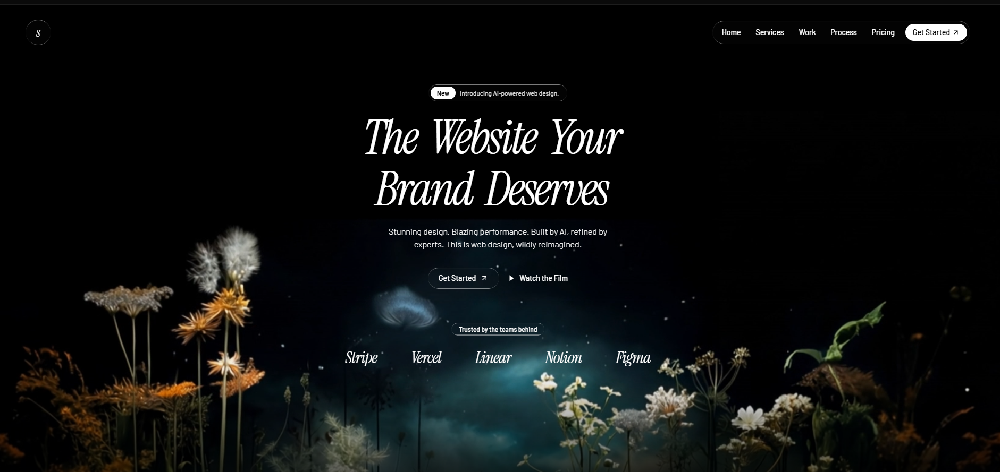

# 20 — Studio · The Website Your Brand Deserves

Landing oscura premium multi-sección para una agencia de diseño web con AI. **7 secciones** apiladas con backgrounds en vídeo (1 MP4 CloudFront + 3 streams HLS Mux), sistema **liquid-glass** + **liquid-glass-strong** consistente en toda la página, tipografía mixta **Instrument Serif italic** (headings) + **Barlow** (body), animaciones BlurText word-by-word con IntersectionObserver, badges/cards/CTAs reutilizables.

## 🖼️ Preview

## 🧱 Tecnologías

Vía **CDN**, sin build step. Adaptación de la spec original (React + Vite + Tailwind + shadcn/ui + motion + hls.js) al formato del catálogo.

- **Tailwind CSS** (CDN runtime, `tailwind.config` extendiendo `fontFamily: { heading, body }`)
- **React 18.3.1** (UMD dev)
- **Babel Standalone 7.29.0**
- **Framer Motion 11.11.17** (UMD → `window.Motion`)
- **hls.js 1.5.15** (UMD → `window.Hls`) para los 3 streams Mux
- **Google Fonts**: Instrument Serif (italic) + Barlow (300/400/500/600)

## 🎨 Sistema de diseño

- **Fondo**: negro puro `#000` en body y entre secciones.
- **Texto**: blanco / `white/60` / `white/70` / `white/80` para jerarquía.
- **Tipografía**:
  - Headings: `font-heading italic` = Instrument Serif italic con `tracking-tight` y `leading-[0.9]`
  - Body: `font-body font-light` = Barlow light
- **Liquid Glass**: dos variantes (`subtle` blur 4px + `strong` blur 50px) con borde mask-composite que crea un highlight superior/inferior. Usados en navbar pill, badges, cards, CTAs.
- **Color theme** (CSS vars HSL definidas pero no usadas directamente — el diseño es 100% white/black/transparencies):
  - `--background: 213 45% 67%` (azul-gris) — disponible para variantes light.
  - `--glass-bg / --glass-border / --glass-blur` definidos en `:root`.

## 🧩 Las 7 secciones

### 1. Navbar (fixed top-4 z-50)
- Logo circular `liquid-glass` con letra "s" Instrument Serif.
- Pill central `liquid-glass rounded-full` con 5 links (Home / Services / Work / Process / Pricing) + CTA blanco "Get Started" + ArrowUpRight.

### 2. Hero (1000px height)
- **Vídeo MP4 CloudFront** posicionado con `top: 20%`, `object-contain`.
- Overlay sutil `bg-black/5` + gradiente bottom 300px black-to-transparent.
- Badge pill "New · Introducing AI-powered web design."
- H1 con `<BlurText>`: "The Website Your Brand Deserves" — Instrument Serif italic, clamp 6xl→[5.5rem].
- Subtext con motion.p (delay 0.8s) + 2 CTAs (delay 1.1s).
- Partners bar: 5 nombres en Instrument Serif italic (Stripe / Vercel / Linear / Notion / Figma).

### 3. StartSection (HLS + minHeight 500)
- Stream Mux 1.
- Badge "How It Works" + heading "You dream it. We ship it." + body + CTA "Get Started".

### 4. FeaturesChess
- 2 rows alternadas (chess pattern): text izq + GIF der, después text der + GIF izq.
- GIFs vienen de `motionsites.ai` (no descargados, servidos directo).

### 5. FeaturesGrid (4 cards)
- Grid `md:grid-cols-2 lg:grid-cols-4`.
- Cada card `liquid-glass rounded-2xl p-6` con icono `liquid-glass-strong` circular 10×10.
- Iconos lucide: Zap, Palette, BarChart3, Shield.

### 6. Stats (HLS desaturado + filter: saturate(0))
- Stream Mux 2.
- Card `liquid-glass rounded-3xl` con 4 stats: 200+ / 98% / 3.2x / 5 days.

### 7. Testimonials (3 cards)
- Quotes italic + name + role.

### 8. CtaFooter (HLS)
- Stream Mux 3.
- Heading gigante "Your next website starts here." + 2 CTAs (glass-strong + white).
- Footer bar con © 2026 + 3 links (Privacy / Terms / Contact).

## ⚙️ Componentes reutilizables

- **`<BlurText>`** — split por palabras, cada palabra es motion.span con keyframes `filter blur(10px)→0`, `opacity 0→1`, `y 50→0`. Trigger con `IntersectionObserver` (threshold 0.1). Stagger `i * delayMs / 1000`.
- **`<HlsBg src filter>`** — vídeo `<video>` con hls.js wired up + cleanup en unmount. Fallback nativo a `application/vnd.apple.mpegurl` para Safari.
- **`<Badge>`** — pill `liquid-glass rounded-full px-3.5 py-1` text-xs.
- **`<SectionHeading>`** — H2 Instrument Serif italic con tracking-tight + leading-[0.9].
- **`<BodyText>`** — p text-white/70 font-body font-light.
- **`<FadeBars top bottom>`** — gradientes black-to-transparent encima/debajo de los HLS videos.

## ⚠️ Notas de rendimiento

- **3 streams HLS simultáneos** + 1 MP4 fullscreen — pesado para móvil. En producción, considera lazy-init de los HLS con `IntersectionObserver` (sólo crear el Hls cuando la sección entra en viewport).
- Los 2 GIFs de motionsites son ~5MB cada uno. `loading="lazy"` ya está aplicado.
- **`document.hidden: true` pausa el autoplay de los videos** — en preview headless las animaciones de fondo no se ven, pero el DOM está correctamente montado.

## ▶️ Cómo usarla

1. Abrir `index.html` directamente o vía el viewer del catálogo.
2. Sin `npm install`, sin build.
3. Los 4 vídeos (1 MP4 + 3 HLS) vienen de CloudFront/Mux — si caen, sustituir las constantes URL del top.
4. Los 2 GIFs vienen de motionsites.ai — sustituir si caen.

## 📝 Notas / Pendientes

- [x] Añadir `preview.png` (Captura de pantalla 2026-05-14 104528 — hero con escena editorial de campo de flores silvestres nocturno, headline "The Website Your / Brand Deserves" en Instrument Serif italic gigante, nav liquid-glass pill, partners Stripe/Vercel/Linear/Notion/Figma)
- [ ] El logo es un placeholder (letra "s" en Instrument Serif). Si tienes un PNG/SVG real, sustituir el div interior del Navbar.
- [ ] El poster `/images/hero_bg.jpeg` no se incluye — el `<video>` carga el primer frame del MP4 como poster por defecto.
- [ ] Para producción, considera descargar los HLS streams a tu propio CDN para evitar lag y CORS.
