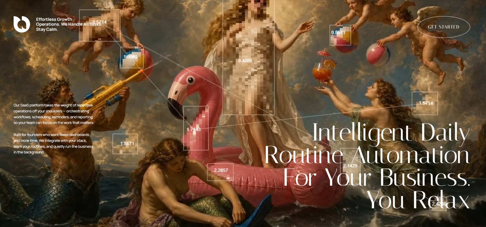

# 21 — Intelligent Daily Routine Automation

Landing de **2 secciones scroll-based** para una SaaS de automatización. Hero con vídeo + título Italiana mega + CTA pill blanco, y transición a una **sección roja `#FF0000`** con un **overlay de nubes que hace parallax** según el scroll. Logo SVG orgánico abstracto, signature "S.P.D" en Marck Script cursive, y un vídeo bottom que cierra la composición.

## 🖼️ Preview



## 🧱 Tecnologías

Vía **CDN**, sin build step. Adaptación de la spec original (React 19 + Vite + TS + Tailwind v4 + motion/react) al formato del catálogo.

- **Tailwind CSS** (CDN runtime, fontFamily extendido)
- **React 18.3.1** (vs. React 19 de la spec — UMD dev)
- **Babel Standalone 7.29.0**
- **Framer Motion 11.11.17** (UMD → `window.Motion` para `useScroll` + `useTransform`)
- **Google Fonts**: Manrope (400/600) + Italiana + Marck Script

## 🎨 Sistema de diseño

- **Section 1** (hero): vídeo local `hero-video.mp4` (1280x720, 5,1 s) fullscreen, paleta blanco sobre el vídeo, CTA glass pill borde blanco.
- **Section 2** (red): bg `#FF0000` puro. Logo blanco, copy uppercase, signature Marck Script y vídeo bottom.
- **Tipografía**:
  - Body: **Manrope** (400/600).
  - Headings + CTA + sección texto principal: **Italiana** serif clásico.
  - Signature "S.P.D": **Marck Script** cursive a 120px.

## 🌥️ Cloud Parallax (el efecto estrella)

El `<main>` usa `overflow-y-auto` como **scroll container** propio (no usa el scroll del body), porque framer-motion's `useScroll({ container })` necesita un ref de elemento que tenga scroll interno.

```ts
const containerRef = useRef(null);
const { scrollY } = useScroll({ container: containerRef });
const cloudYDesktop = useTransform(scrollY, [0, 300], [0, -100]);
const cloudYMobile  = useTransform(scrollY, [0, 300], [0, -24]);
```

Las nubes (`<motion.div style={{ y: cloudYDesktop }}>`) están posicionadas con `-translate-y-1/2` en la frontera entre la sección 1 y 2. Al hacer scroll, suben 100px (desktop) / 24px (mobile), creando la sensación de **atravesar las nubes hacia la sección roja**.

## 🧩 Estructura

```
<main ref=containerRef h-screen overflow-y-auto bg-black>
  ├─ Section 1 (h-screen video hero)
  │     ├─ <video> hero fullscreen
  │     ├─ Top-left: logo SVG + tagline (mobile/desktop variants)
  │     ├─ Left description (desktop only)
  │     ├─ Top-right CTA pill "Get started" (italiana, glass border)
  │     └─ Bottom heading H1 italiana grande (32px mobile / 96px desktop)
  │
  └─ Section 2 (min-h-screen bg-#FF0000)
        ├─ Cloud overlays (desktop + mobile, motion.div con y: cloudY*)
        ├─ Content centered:
        │     ├─ Logo 80×80
        │     ├─ Paragraph uppercase
        │     ├─ Signature "S.P.D" Marck Script 120px
        │     └─ 2 paragraphs
        └─ Bottom video block con fade superior
```

## 🎯 SVG Logo

Path orgánico viewBox `0 0 120 120`, llena en blanco, forma estilizada que recuerda a una "P" curva — usado como brand identity en ambas secciones (tamaño 48/64/80 según contexto).

## ▶️ Cómo usarla

1. Abrir `index.html` directamente o vía el viewer del catálogo.
2. Sin `npm install`, sin build.
3. Los 3 assets son **locales** (`hero-video.mp4`, `bottom-video.mp4`, `cloud.png`). Antes venían de Cloudinary y la cuenta se cayo (401 en toda la cuenta, incluido su `sample.jpg`); se recuperaron los originales desde el Internet Archive y se guardaron en la carpeta para que no vuelvan a romperse.
4. Hacer scroll para ver la transición de nubes entre las 2 secciones.

## 📝 Notas / Pendientes

- [x] Añadir `preview.png` (Captura de pantalla 2026-05-14 124608 — escena renacentista surreal con sirena/cherubs/flamingo inflatable y elementos pixelados con stats overlay, headline "Intelligent Daily / Routine Automation / For Your Business. / You Relax" en Italiana bottom-right)
- [ ] El cloud parallax requiere que la pestaña esté en foreground (rAF se pausa en background — verificado).
- [ ] El `<main>` con su propio scroll container puede romper el back-button scroll del navegador. Si necesitas scroll a nivel body, sustituir `useScroll({ container })` por `useScroll()` y mover el scroll al body.
- [ ] Las dos descripciones de párrafo (sección 1 izquierda + sección 1 bottom mobile) son inventadas/parafraseadas. Sustituir por copy real si lo tienes.
- [ ] El vídeo bottom (`bottom-video.mp4`) no se posiciona absoluto — se inserta como bloque normal al final de la sección roja, así que ocupa altura adicional del scroll.
