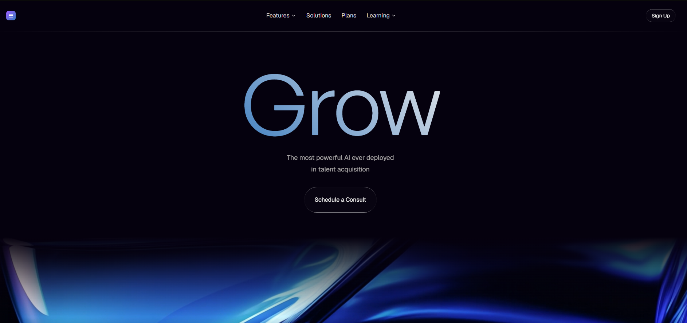

# 22 — Grow · The most powerful AI in talent acquisition

Landing oscura deep-purple para una plataforma de recruitment con AI. Hero con título gigante **"Grow"** en gradient text (General Sans clipeado), CTA liquid-glass pill **"Schedule a Consult"**, navbar con 4 items + Sign Up. Social proof section con **vídeo de fondo que hace fade-in/out manual via rAF** (loop seamless sin cortes) y **marquee horizontal infinito** de 6 brand logos duplicados.

## 🖼️ Preview



## 🧱 Tecnologías

Vía **CDN**, sin build step. Adaptación de la spec original (React + Vite + TS + Tailwind + shadcn/ui + @fontsource/geist-sans) al formato del catálogo.

- **Tailwind CSS** (CDN runtime, theme tokens HSL via CSS vars, marquee keyframe + 20s linear infinite)
- **React 18.3.1** (UMD dev)
- **Babel Standalone 7.29.0**
- **Google Fonts**: Geist (400/500/600/700) para body + nav
- **Fontshare**: General Sans (400/500) para el título mega
- **Sin shadcn/ui**: button variants reimplementados como clases Tailwind directas

## 🎨 Sistema de diseño

Theme dark único definido como CSS vars HSL:

```css
--background: 260 87% 3%   → deep purple-black rgb(5,1,14)
--foreground: 40 6% 95%    → cream
--primary:    262 83% 58%  → violet
--secondary / muted: 240 4% 16%
--hero-heading: 40 10% 96%
--hero-sub: 40 6% 82%
```

Tailwind config extiende `colors.{background,foreground,...}` mapeados a `hsl(var(--token))`.

## 🌟 Componentes destacados

### Hero
- H1 **"Grow"** en General Sans, `clamp(96px, 22vw, 230px)`, `font-weight: 400`, `tracking: -0.024em`.
- **Gradient text** clipeado:
  ```css
  background: linear-gradient(223deg, #E8E8E9 0%, #3A7BBF 104.15%);
  background-clip: text;
  -webkit-text-fill-color: transparent;
  ```
- Subtítulo dos líneas + CTA liquid-glass pill.

### Navbar
- Logo SVG gradient (placeholder) izquierda + 4 nav items (Features/Solutions/Plans/Learning con ChevronDown lucide) + Sign Up derecha.
- Divider gradient bajo el nav: `bg-gradient-to-r from-transparent via-foreground/20 to-transparent`.

### Social Proof / Video Section
- **Vídeo CloudFront** con **fade-in/out loop manual**:
  ```js
  const FADE = 0.5;  // seconds
  if (currentTime < FADE)              op = currentTime / FADE;
  else if (currentTime > duration - FADE) op = (duration - currentTime) / FADE;
  else                                  op = 1;
  v.style.opacity = String(op);
  ```
- `requestAnimationFrame` continuo lee `currentTime`/`duration` y actualiza opacity.
- On `ended`: opacity → 0, espera 100ms, `currentTime = 0`, replay. Resultado: loop infinito sin saltos visibles entre cycles.
- Gradient overlay superior + inferior `from-background via-transparent to-background` (funde con el bg de la página).

### Logo Marquee
- 6 brands (Vortex / Nimbus / Prysma / Cirrus / Kynder / Halcyn) **duplicados** = 12 elementos para hacer loop seamless.
- Animación `marquee 20s linear infinite` (keyframes `translateX(0%) → translateX(-50%)`).
- Cada logo: cuadrado `liquid-glass w-6 h-6 rounded-lg` con la inicial + nombre en `text-base font-semibold`.

## ⚙️ Marquee CSS

```js
keyframes: {
  marquee: {
    '0%':   { transform: 'translateX(0%)' },
    '100%': { transform: 'translateX(-50%)' },
  },
},
animation: {
  marquee: 'marquee 20s linear infinite',
},
```

El `-50%` funciona porque la lista está duplicada — cuando el primer set sale por la izquierda, el segundo set lo reemplaza sin corte visible.

## ▶️ Cómo usarla

1. Abrir `index.html` directamente o vía el viewer del catálogo.
2. Sin `npm install`, sin build.
3. El vídeo viene de CloudFront — si cae, sustituir `VIDEO_SRC`.

## 📝 Notas / Pendientes

- [x] Añadir `preview.png` (Captura de pantalla 2026-05-14 130017 — fondo deep purple-black con curvas/flares azules en los costados, título mega "Grow" en gradient text cream→azul, subtítulo en dos líneas, CTA glass "Schedule a Consult", navbar arriba)
- [ ] El logo del navbar es un SVG gradient placeholder. Si tienes un PNG real, sustituir el componente `<Logo>`.
- [ ] El **video fade-loop** requiere que la pestaña esté en foreground (rAF se pausa en background — verificado).
- [ ] El marquee con `animate-marquee` también se pausa cuando la pestaña queda en background; en pestaña activa fluye continuo.
