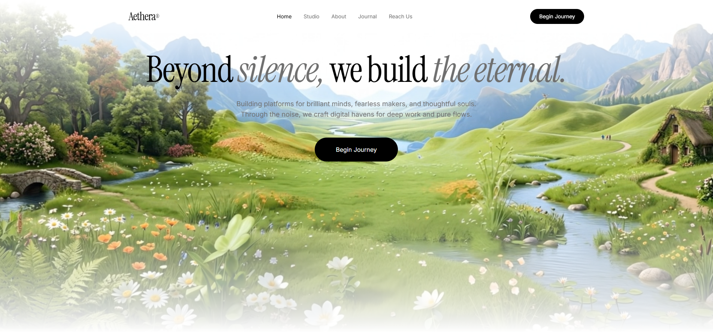

# 23 — Aethera · Beyond silence, we build the eternal

Hero único minimalista en **light theme** (fondo blanco) con vídeo posicionado abajo que hace **fade-in/out manual via rAF** en bucle seamless. Wordmark Instrument Serif **"Aethera®"**, navbar de 5 links con un activo + CTA pill negro, headline editorial con **dos palabras en italics gris** (`silence,` y `the eternal.`) como acentos contra el negro. Animaciones `fade-rise` escalonadas (0 / 0.2s / 0.4s).

Es la **contraparte light** de la plantilla 03 (Velorah) — misma estructura editorial, paleta invertida.

## 🖼️ Preview



## 🧱 Tecnologías

Vía **CDN**, sin build step. Adaptación de la spec original (React + Vite + TS + Tailwind) al formato del catálogo.

- **Tailwind CSS** (CDN runtime)
- **React 18.3.1** (UMD dev)
- **Babel Standalone 7.29.0**
- **Google Fonts**: Instrument Serif (italic + roman) + Inter (400/500)

## 🎨 Sistema de diseño

- **Page bg**: blanco `#FFFFFF`.
- **Headings + wordmark + CTA**: negro `#000000`.
- **Body text + nav links inactivos + acentos italics**: gris `#6F6F6F`.
- **CTA text**: blanco sobre negro.
- **Tipografía**:
  - Display (headline + wordmark): **Instrument Serif**
  - Body (nav + descripción + button): **Inter**

## 🎯 Headline con italics gray

```html
<h1>
  Beyond <em style="color: #6F6F6F">silence,</em>
  we build <em style="color: #6F6F6F">the eternal.</em>
</h1>
```

Las dos palabras envueltas en `<em>` heredan `font-style: italic` y se renderizan en la variante italic de Instrument Serif. El color `#6F6F6F` las pinta gris medio, creando contraste tonal contra el negro del resto del título — efecto editorial elegante.

H1 specs:
- font-size `text-5xl sm:text-7xl md:text-8xl` (48px → 96px → 128px)
- line-height `0.95`
- letter-spacing `-2.46px`
- max-w-7xl

## 🎬 Video fade-loop (mismo pipeline que plantilla 22)

```js
const FADE = 0.5;  // seconds
if (currentTime < FADE) op = currentTime / FADE;
else if (currentTime > duration - FADE) op = (duration - currentTime) / FADE;
else op = 1;
v.style.opacity = String(op);
```

- `requestAnimationFrame` continuo lee `currentTime`/`duration` y aplica opacity al vídeo.
- On `ended`: opacity → 0, espera 100ms, `currentTime = 0`, replay.
- Resultado: loop infinito sin saltos visibles.

El vídeo está posicionado con `top: 300px` y `inset: auto 0 0 0`, así que aparece **en la mitad inferior** del viewport detrás del texto. Un gradiente `to-bottom` lo funde con el fondo blanco arriba y abajo.

## ⚡ Animaciones `fade-rise`

```css
@keyframes fade-rise {
  from { opacity: 0; transform: translateY(20px); }
  to   { opacity: 1; transform: translateY(0); }
}
.animate-fade-rise         { animation: fade-rise 0.8s ease-out      both; }
.animate-fade-rise-delay   { animation: fade-rise 0.8s ease-out 0.2s both; }
.animate-fade-rise-delay-2 { animation: fade-rise 0.8s ease-out 0.4s both; }
```

Aplicadas en orden:
- H1 → `fade-rise` (0s)
- Subtítulo → `fade-rise-delay` (0.2s)
- CTA → `fade-rise-delay-2` (0.4s)

## 🧩 Estructura

```
<div min-h-screen relative bg-white>
  ├─ <div absolute top:300px z-0> wrapper de video
  │     └─ <video> con fade rAF, initial opacity 0
  ├─ <div absolute inset-0 z-1> gradient overlay top/bottom blanco
  └─ <div relative z-10>
       ├─ <nav max-w-7xl mx-auto>
       │     ├─ "Aethera®" wordmark Instrument Serif
       │     ├─ 5 links: Home (active) / Studio / About / Journal / Reach Us
       │     └─ "Begin Journey" CTA pill negro
       └─ <section text-center px-6 pb-40>
            ├─ H1 Instrument Serif con 2 <em> italics gray
            ├─ subtítulo gris max-w-2xl
            └─ CTA "Begin Journey" pill negro mt-12
```

## ▶️ Cómo usarla

1. Abrir `index.html` directamente o vía el viewer del catálogo.
2. Sin `npm install`, sin build.
3. El vídeo está en CloudFront — si cae, sustituir `VIDEO_SRC`.

## 📝 Notas / Pendientes

- [x] Añadir `preview.png` (Captura de pantalla 2026-05-14 142301 — paisaje pastoral idílico con flores silvestres, riachuelo, puente de piedra y montañas; headline "Beyond silence, we build the eternal." con italics gris superpuestas sobre la escena)
- [ ] El video fade-loop requiere pestaña en foreground (rAF se pausa en background — verificado).
- [ ] La spec especifica el vídeo posicionado a `top: 300px`; si la cabecera + heading + subtítulo ocupan más espacio que esos 300px, el vídeo queda escondido detrás del CTA. En navegador desktop con altura ≥800px no es problema.
