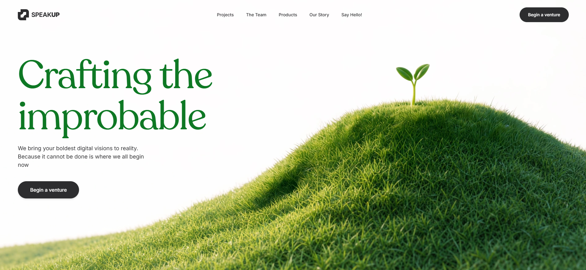

# 24 — Speakup · Crafting the improbable

Hero único en **light theme** para una agencia creativa. Logo SVG estilizado (cuadrado con cuadrante mordido) + wordmark **SPEAKUP** (mezcla de bold + black), heading **"Crafting the / improbable"** en **Recoleta Regular** verde brand `#0E7824`, navbar con 5 links + CTA pill negro `#2D2D2F`, y hamburguesa móvil con overlay full-screen blanco. Vídeo de fondo sin overlay (a opacidad completa).

## 🖼️ Preview



## 🧱 Tecnologías

Vía **CDN**, sin build step. Adaptación de la spec original (React + TS + Tailwind + lucide-react) al formato del catálogo.

- **Tailwind CSS** (CDN runtime, extendido con `fontFamily.recoleta/inter` y `colors.brand.{green,dark}`)
- **React 18.3.1** (UMD dev)
- **Babel Standalone 7.29.0**
- **Recoleta Regular** vía `db.onlinewebfonts.com` (sólo para el H1)
- **Inter 400/500/600/700/900** vía Google Fonts (todo lo demás)
- **Iconos lucide** (Menu, X) inline

## 🎨 Sistema de diseño

- **Page bg**: blanco (vídeo de fondo sin overlay).
- **Brand green** `#0E7824` — exclusivo para el H1.
- **Brand dark** `#2D2D2F` — wordmark, nav text, CTA pills, hamburger.
- **Hover state**: nav links pasan de `#2D2D2F` a `#0E7824` (verde brand).
- **CTA hover**: pill negro `#2D2D2F` → negro puro `#000`.
- **Tipografía**:
  - **Recoleta Regular**: sólo H1 (`font-recoleta` utility).
  - **Inter**: body, nav, subtítulo, wordmark, CTAs.

## 🧩 Estructura

```
<section relative w-full overflow-hidden h-100vh>
  ├─ <video> autoPlay muted loop playsInline (z-0)
  ├─ <nav relative z-20 px-12 lg:px-16 pt-6>
  │     ├─ Logo SVG + "SPEAK" (bold) + "UP" (black)
  │     ├─ 5 links centrales (hidden lg:flex): Projects / The Team / Products / Our Story / Say Hello!
  │     ├─ CTA "Begin a venture" pill negro (hidden lg:inline-flex)
  │     └─ Hamburger Menu icon (lg:hidden)
  ├─ <div relative z-10 px-12 lg:px-16 mt-8 md:mt-16 lg:mt-24 max-w-7xl>
  │     ├─ H1 Recoleta verde clamp(56px, 13vw, 128px)
  │     ├─ Subtítulo Inter dark max-w-md
  │     └─ CTA hero "Begin a venture" pill negro
  └─ Mobile overlay (when menuOpen): full-screen white con 5 links + CTA
```

## 🎯 Logo SVG

Path stilizado (viewBox 256×256) que dibuja un cuadrado con esquinas mordidas — una variante creativa del `rounded square + corner notch` típico de marcas tech. Fill `#2D2D2F` (color brand dark).

## 📱 Mobile

En `<lg:1024px`:
- Nav links y CTA derecho se ocultan.
- Aparece la hamburguesa que abre un overlay `fixed inset-0 z-50 bg-white`.
- Overlay muestra: header con logo + X close, 5 links apilados en `text-2xl`, CTA pill al final.

## ▶️ Cómo usarla

1. Abrir `index.html` directamente o vía el viewer del catálogo.
2. Sin `npm install`, sin build.
3. El vídeo está en CloudFront — si cae, sustituir `VIDEO_SRC`.
4. Si `db.onlinewebfonts.com` (Recoleta) cae, el H1 caerá a serif del sistema. Para producción considerar self-hosting de Recoleta.

## 📝 Notas / Pendientes

- [x] Añadir `preview.png` (Captura de pantalla 2026-05-14 142739 — colina cubierta de hierba verde brillante con un brote naciente emergiendo del suelo, headline "Crafting the / improbable" en verde brand a la izquierda, simbolizando crecimiento creativo)
- [ ] Recoleta es un font propietario (Latinotype). El CDN onlinewebfonts no está oficialmente licenciado — para producción, comprar la licencia y self-hostear.
- [ ] El hover de los nav links cambia el `style.color` manualmente vía `onMouseEnter/Leave` porque `hover:text-brand-green` requeriría el plugin de Tailwind para que `brand.green` esté activo en hover. Con el config extendido inline funciona también, pero por seguridad usamos inline-style.
