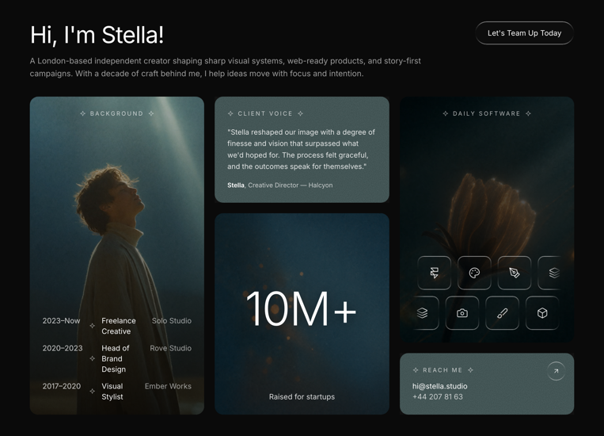

# 26 — Max Reed · London-based independent creator

Sección **Features bento** para un portfolio personal. Grid de **3 columnas** con cards dark + verde grisáceo `#324444`. Combina vídeos de fondo, timeline de carrera con sparkles, stats grandes, 2 marquees infinitos de iconos de software y un bloque de contacto.

## 🖼️ Preview



> ⚠️ Falta pegar `preview.png` en esta carpeta.

## 🧱 Tecnologías

Vía **CDN**, sin build step. Adaptación de la spec original (React + TS + Tailwind + lucide-react) al formato del catálogo.

- **Tailwind CSS** (CDN runtime)
- **React 18.3.1** (UMD dev)
- **Babel Standalone 7.29.0**
- **Google Fonts**: Inter (300/400/500/600)
- **14 iconos lucide inline** (ArrowUpRight, Sparkle, Figma, Framer, Palette, PenTool, Layers, Type, Aperture, Chrome, Camera, Brush, Box, Wand2)

## 🎨 Sistema de diseño

- **Base**: `#0a0a0a` page bg, blanco/`white/85`/`white/70`/`white/60` para texto.
- **Card accent** verde grisáceo `#324444` (Client Voice + Reach Me).
- **Cards vídeo**: `bg-black` + vídeo `object-cover opacity-70` + overlay `bg-black/40` para legibilidad del label.
- **Liquid glass**: usado en CTA "Let's Team Up Today", icon tiles del marquee, y botón ArrowUpRight de Reach Me.
- **Noise overlay** SVG fractalNoise (240×240) con `mix-blend-mode: soft-light` opacity 0.55 — aplicado sobre las 2 cards #324444 para textura sutil.

## 🧩 Layout (3 columnas en lg, 2 en md, 1 mobile)

### Col 1 — Background
- Vídeo de fondo + label **BACKGROUND** con sparkles a cada lado
- Timeline 4-col `[auto_auto_1fr_auto]`:
  - `2023–Now ✦ Freelance Creative ··· Solo Studio`
  - `2020–2023 ✦ Head of Brand Design ··· Rove Studio`
  - `2017–2020 ✦ Visual Stylist ··· Ember Works`

### Col 2 — Stacked
- **Client Voice** (top): card `#324444` con noise overlay. Quote larga + autoría "**Elena Brooks**, Creative Director — Halcyon".
- **10M+** (bottom): vídeo bg + "10M+" gigante centrado (clamp 5xl→88px) + caption "Raised for startups".

### Col 3 — Stacked
- **Daily Software** (top): vídeo bg + label **DAILY SOFTWARE** + 2 marquees:
  - Row 1 (left, 22s): Figma · Framer · Palette · PenTool · Layers · Type · Aperture · Chrome
  - Row 2 (right, 26s): Camera · Brush · Box · Wand2 · Figma · Framer · Type · Layers
  - Mask edges fade `linear-gradient(to right, transparent, black 8%, black 92%, transparent)`
  - Cada icono va en un tile `liquid-glass h-16 w-16 rounded-xl`
- **Reach Me** (bottom): card `#324444` con noise. Email + phone + botón ArrowUpRight glass top-right.

## ⚙️ Animaciones

```css
@keyframes marquee-left  { from { translateX(0); }     to { translateX(-50%); } }
@keyframes marquee-right { from { translateX(-50%); } to { translateX(0); } }
.animate-marquee-left  { animation: marquee-left  22s linear infinite; }
.animate-marquee-right { animation: marquee-right 26s linear infinite; }
```

Listas duplicadas (`[...row, ...row]`) para que `-50%` cierre el loop sin saltos.

## ▶️ Cómo usarla

1. Abrir `index.html` directamente o vía el viewer del catálogo.
2. Sin `npm install`, sin build.
3. Los 3 vídeos vienen de CloudFront — si caen, sustituir las constantes.

## 📝 Notas / Pendientes

- [ ] Añadir `preview.png`
- [ ] Los marquees CSS se pausan en pestañas backgrounded (Chrome throttle). En foreground fluyen continuos a velocidades distintas (22s vs 26s) creando un efecto de profundidad.
- [ ] El noise overlay SVG usa una matriz de color que pasa todos los canales RGB a 1 — genera grain blanco que el `soft-light` blend funde con el bg `#324444` sin alterar el tono base.
